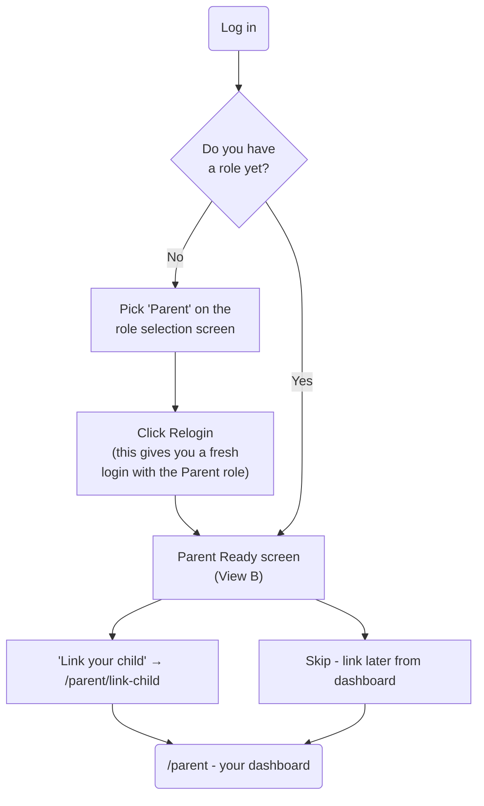
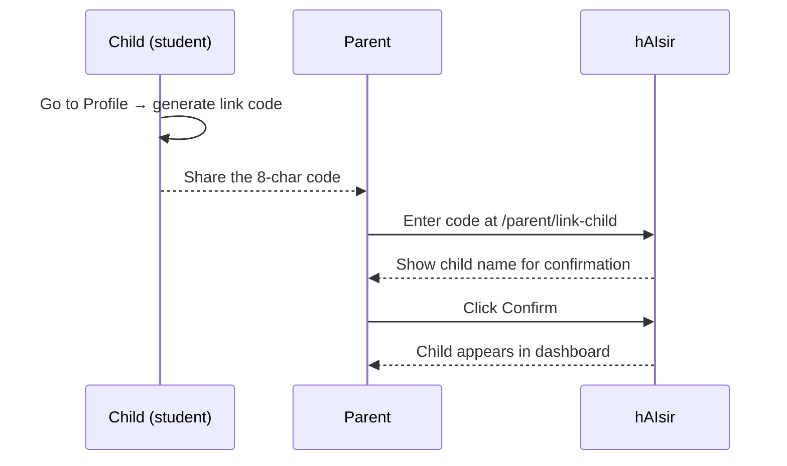
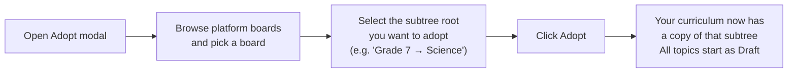
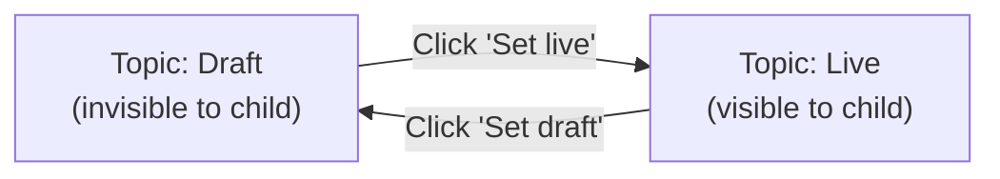

# Parent User Guide

> Role: **Parent** — creates a private curriculum for your linked child. Your content is only visible to children you have actively linked. No other parent, student, or instructor can see it.

---

## Contents

1. [Getting started — setting up your account](#1-getting-started--setting-up-your-account)
2. [Linking your child](#2-linking-your-child)
3. [Parent Dashboard](#3-parent-dashboard)
4. [Building your child's curriculum](#4-building-your-childs-curriculum)
5. [Adding content to a topic](#5-adding-content-to-a-topic)
6. [Publishing content for your child](#6-publishing-content-for-your-child)
7. [Managing multiple children](#7-managing-multiple-children)

---

## 1. Getting started — setting up your account

When you log in for the first time, hAIsir walks you through a short onboarding flow.



After the relogin step your account carries the Parent role and you land on your dashboard at `/parent`.

---

## 2. Linking your child

Your child must generate a **link code** from their own account (under their Profile page). The code is 8 characters, valid for 72 hours, and single-use.

### Steps

1. Ask your child to go to their **Profile** page, generate a link code, and share it with you.
2. In your dashboard, click **Link your child** (or navigate to **Dashboard → Link child**).
3. Enter the 8-character code. The page shows your child's name for confirmation.
4. Click **Confirm** to complete the link.



### Error messages

| Message | What it means |
|---|---|
| Invalid code | Code doesn't exist — check for typos |
| Code expired or already used | Ask your child to generate a new code |
| This child is already linked | You are already linked to this child |
| Maximum of 10 children | You have reached the 10-child limit |

### Revoking a link

On your dashboard, each linked child row has a **Revoke** button. Confirming revoke immediately hides your content from that child. The link can be re-established later using a new code.

---

## 3. Parent Dashboard

Your dashboard at `/parent` is the central hub.

- **Child selector** — a strip of pills at the top, one per linked child. Click a pill to switch context to that child. The selected child is remembered across visits.
- **+ Add another child** — visible once at least one child is linked; use this to link additional children.
- **Link your child** card — shown when no children are linked yet.
- **Curriculum** link — takes you to the curriculum builder.

---

## 4. Building your child's curriculum

Navigate to **Curriculum** (`/parent/curriculum`) to build the course structure.

### Two starting options

| Option | When to use |
|---|---|
| **Adopt from Platform** | Use an existing platform board as the starting structure. Saves building nodes from scratch. |
| **Build from scratch** | Create your own node tree with custom labels and types. |

### Adopt from Platform

Adoption copies the platform's node tree (grade levels, subjects, courses, chapters, etc.) into your private curriculum. It does **not** copy any content or exams — you upload your own material after adopting.



**Important:** adopting the same subtree a second time shows an "Already adopted" message — each subtree can only be adopted once. You can still add topics manually to the adopted nodes.

### Build from scratch

1. Click **Build from scratch**.
2. Choose a node type (e.g. `course`, `chapter`, `module`) and give it a label.
3. Select the newly created node in the tree and add child nodes under it.
4. Keep adding until your structure matches your curriculum.

### Node types

| Type | Typical use |
|---|---|
| `course` | A full subject area (e.g. "Grade 5 Maths") |
| `chapter` | A unit within a course |
| `module` | A sub-unit within a chapter |
| `section` | A section within a module |
| `unit` | General subdivision |
| `week` | Week-based pacing |
| `skill` | A specific skill or competency |

### Renaming and deleting nodes

- **Rename** — double-click the node name in the tree, edit, press Enter.
- **Delete** — click the × button on the node. Deleting a node removes all child nodes and topics under it (cascade). This is blocked if any topic has an active exam session in progress.

### Managing topics

Select any node in the tree to see its topics in the right panel.

- **Add topic** — click **+ Add topic**, enter a title.
- **Rename** — click the topic title inline.
- **Delete** — click the × on the topic row.
- **Draft / Live toggle** — controls whether your child can see the topic (see [Publishing](#6-publishing-content-for-your-child)).

---

## 5. Adding content to a topic

Click the topic row to open its **Topic Content Manager** page, or click **+ Add content** directly on the topic row.

### Content types

| Type | What happens |
|---|---|
| **PDF** | Uploaded → text is extracted automatically in the background |
| **Image(s)** | Uploaded → text is extracted via vision AI (OCR) in the background |
| **Video URL** | Paste a YouTube or Vimeo link — saved instantly |
| **Text** | Type or paste markdown — saved instantly |

### Uploading a PDF or image

```mermaid
sequenceDiagram
    participant You as You (parent)
    participant App
    participant Worker as Background worker

    You->>App: Open Add Content modal → pick PDF or Image
    You->>App: Drag-drop file(s), review cost estimate, click Upload
    App-->>You: Modal closes; "Queued" pill appears on the topic
    App->>Worker: File sent to extraction queue

    loop every few seconds
        App->>App: Check job status
        App-->>You: Progress bar updates
    end

    Worker-->>App: Extraction complete
    App-->>You: Content rows appear with source badge (e.g. from notes.pdf, p.3)
```

**Limits:** up to 5 files at a time, max 50 MB per file. You have a quota of 5 simultaneous jobs and 100 jobs per day.

**Cost estimate:** shown before upload. If the estimate exceeds $2, tick the confirmation checkbox to enable the Upload button.

### After content is extracted

Each extracted text row shows a **provenance badge** telling you which file and page it came from. You can rename the content title freely — it doesn't affect the audit record.

### Indexing for AI (hAITU)

After a content item is saved (whether typed or extracted), the system queues it for **AI indexing** so hAITU can use it when your child asks questions. A small status pill shows the indexing progress:

| Pill | Meaning |
|---|---|
| ⏱ Queued for indexing | Waiting for the indexing worker |
| 🌀 Indexing | Being processed right now |
| 🔁 Retrying (n/3) | Retry in progress after a transient error |
| ✕ Indexing failed | Permanent failure — click **Retry** to try again |
| *(no pill)* | Indexed successfully; hAITU can use this content |

If a content item shows **Indexing failed**, click the **Retry** button next to it. If it keeps failing, the content text is still visible to your child — only the AI question-answering is affected.

### Inline content management

- **Rename** — click the content title to edit it inline (Enter to save, Escape to cancel).
- **Edit** — click the Edit button to change the URL, text, or description.
- **Delete** — click × to remove the content. The extraction audit record is preserved even after deletion.

---

## 6. Publishing content for your child

Content is only visible to your linked child when **both** conditions are met:

1. The **topic** is set to **Live**.
2. Your child has an active link to your account.

New topics always start as **Draft**.



**Tip:** add and review all your content before publishing. Once a topic is Live, your child can see it immediately.

---

## 7. Managing multiple children

You can link up to **10 children** to your account. Each child sees only your content — they cannot see each other's names or activity.

The **child selector strip** on your dashboard lets you switch between children. The curriculum and topics you build are shared across all your linked children — there is no per-child curriculum in this version.

To add another child, click **+ Add another child** on your dashboard and repeat the [linking steps](#2-linking-your-child).

To remove a child, click **Revoke** next to their name in the dashboard. This immediately hides your content from them. You can re-link them at any time using a fresh code.
