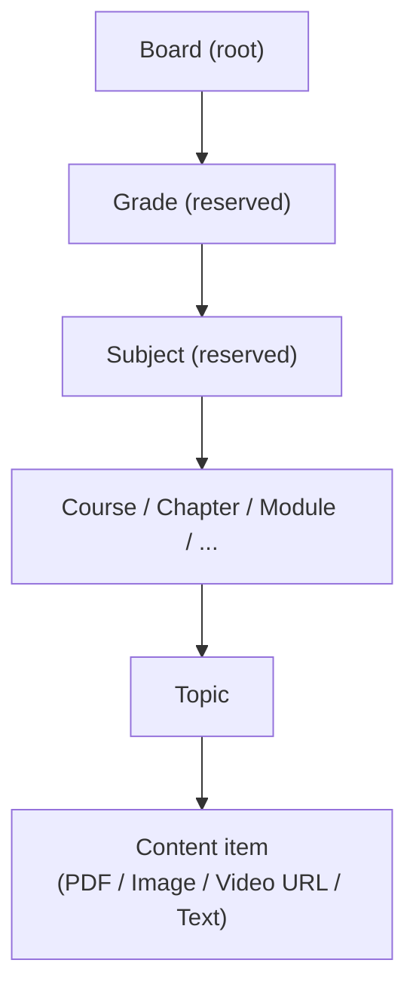
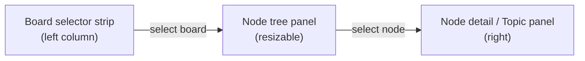
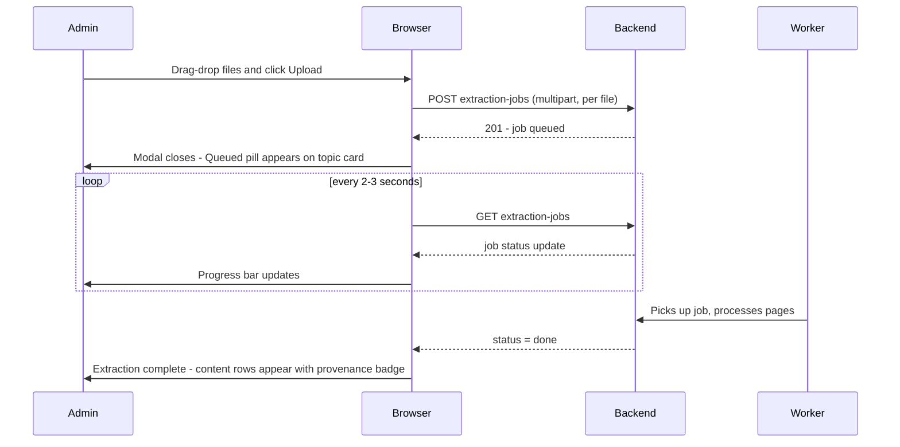
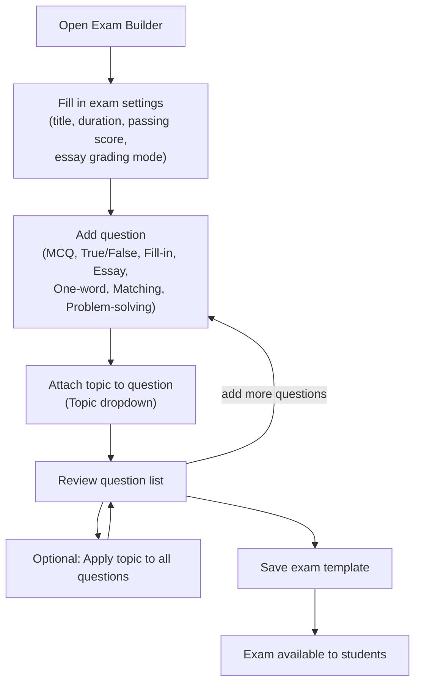

# Platform Admin User Guide

> Role: **Platform Admin** (`admin`) — manages the authoritative platform board content visible to all students.

---

## Contents

1. [Navigating the Admin area](#1-navigating-the-admin-area)
2. [Dashboard overview](#2-dashboard-overview)
3. [Board & content structure](#3-board--content-structure)
4. [Managing boards](#4-managing-boards)
5. [Managing nodes (the curriculum tree)](#5-managing-nodes-the-curriculum-tree)
6. [Managing topics](#6-managing-topics)
7. [Adding content to a topic](#7-adding-content-to-a-topic)
8. [Monitoring extraction jobs](#8-monitoring-extraction-jobs)
9. [Building exams](#9-building-exams)
10. [Worker health](#10-worker-health)

---

## 1. Navigating the Admin area

After logging in as a Platform Admin you land on the **Admin Dashboard** (`/admin`). A dark sidebar on the left gives you access to the three main areas:

| Sidebar item | Route | Purpose |
|---|---|---|
| 🏠 Dashboard | `/admin` | Platform overview stats + board list |
| 📚 Board content | `/admin/boards` | Full board/node/topic/content management |
| ⚙️ Workers | `/admin/system/workers` | Background worker health |

---

## 2. Dashboard overview

The dashboard shows four summary cards and a list of all platform boards.

**Platform Overview cards**

| Card | What it shows |
|---|---|
| Platform boards | Total number of top-level boards |
| Live topics | Topics currently visible to students |
| Draft topics | Topics still in progress |
| Total topics | Live + draft combined |

**Board cards** — each card shows the board name, live/draft topic counts, and a "Manage" link to the Board Content Manager for that board. Click anywhere on a card (or the "Manage" link) to go straight to that board's content tree.

You can also add a new board from the dashboard using the **+ Add board** button.

---

## 3. Board & content structure

Everything in the platform is organised in a strict hierarchy:

**Key rules:**

- A **Board** is the top-level container (e.g. "NCERT", "CBSE").
- Under a Board the first level must be a **Grade** node (🔒 reserved type).
- Under a Grade the next level must be a **Subject** node (🔒 reserved type).
- Below Subject you can use any of the seven regular types: `course`, `chapter`, `module`, `section`, `unit`, `week`, `skill`.
- **Topics** live inside regular nodes and hold the actual content items.
- Content is only visible to students when the topic's status is **Live**.

---

## 4. Managing boards

### Add a board

1. Click **+ Add board** on the dashboard or at the bottom of the board selector strip in the Board Content Manager.
2. Enter a **Name** (required) and an optional **Description**.
3. Click **Create board**.

The new board appears in the selector strip and on the dashboard.

### Edit a board description

On the dashboard, click the description text under any board card to open an inline editor. Type the new description and press **Enter** (or click away) to save. Press **Escape** to cancel.

### Delete a board

Boards are deleted by removing all their child nodes first (the Delete button on each node is blocked while children or live topics exist). Once empty, delete the final root node to remove the board from the selector.

---

## 5. Managing nodes (the curriculum tree)

The **Board Content Manager** (`/admin/boards`) has three panels:

### Add a child node

1. Select the parent node in the tree.
2. Click **+ add child** (shown in the node row on hover).
3. Pick a **node type** from the chip selector. Types disabled in grey cannot be used at this level (hierarchy rules enforced automatically).
4. Enter a label and click **Add**.

**Hierarchy enforcement summary:**

| Where you are | Types you can add |
|---|---|
| Directly under a Board root | Grade only (🔒) |
| Under a Grade | Subject only (🔒) |
| Under a Subject or deeper | Any non-reserved type not already an ancestor |

### Rename a node

Double-click the node name in the tree → edit inline → **Enter** to save, **Escape** to cancel.

### Delete a node

Click the **×** in the node row. The delete is blocked with an explanation if the node has children or live topics — resolve those first.

---

## 6. Managing topics

Topics appear in the **right panel** when a regular (non-reserved) node is selected.

### Add a topic

Click **+ Add topic** → enter a title → **Add**.

New topics are created in **draft** status (not visible to students).

### Rename a topic

Click the topic title → edit inline → **Enter** to save.

### Publish / unpublish a topic

Each topic card has a status button:

- **Set live** — makes the topic visible to all enrolled students immediately.
- **Set draft** — hides the topic from students (content is preserved).

### Delete a topic

Click the **×** on the topic card. You will be asked to confirm. Deletion is blocked if the topic has active exam sessions in progress.

---

## 7. Adding content to a topic

Click **+ Add content** on any topic card to open the Add Content modal.

### Content types

| Type | When to use |
|---|---|
| **PDF** | Upload a PDF document. Text is extracted automatically by the worker. |
| **Image(s)** | Upload scanned pages or photos. Text is extracted using vision AI (OCR). |
| **Video URL** | Paste a YouTube or Vimeo link. |
| **Text** | Write or paste markdown text directly. |

### Upload flow for PDF / Image

**Upload limits:** up to 5 files per submission, max 50 MB per file.

**Cost preview:** a cost estimate is shown before upload. If the estimate exceeds $2, a confirmation checkbox must be ticked before the Upload button activates.

**Provenance badge:** each content row extracted from a file shows `✨ from filename.pdf · p.14` so you always know which source page it came from. Renaming the content title doesn't affect this audit record.

### Inline content management

- **Rename** — click the content title to edit it inline (Enter to save, Escape to cancel).
- **Delete** — click the × on the content row. The extraction audit record is preserved even after deletion.

---

## 8. Monitoring extraction jobs

The **extraction jobs strip** on each topic card shows the last three jobs:

| Status pill | Meaning |
|---|---|
| Queued | Job is waiting for a worker |
| Uploading X% | File is being transferred |
| Extracting | Worker is processing pages |
| Failed | Job failed — use **Retry** to re-queue |

**Cancel** stops a pending or in-progress job. **Retry** re-queues a failed job using the already-uploaded source file (no need to re-upload).

The strip automatically stops polling once all jobs are complete and 60 seconds have passed with no new activity.

---

## 9. Building exams

Exams are authored from the **Exam builder** (`/add-exam` or the edit route). Each exam belongs to a board node.

### Exam creation flow

### Question types

| Type | Auto-graded? | Notes |
|---|---|---|
| Single choice | Yes | One correct option |
| True / False | Yes | |
| Multiple choice | Yes | One or more correct options |
| Fill in the blank | Yes | Exact text match |
| One-word response | Yes | Normalised text match |
| Matching | Yes | Partial credit per pair; optional penalty mode |
| Problem solving | Yes (answer only) | Working area captured but unscored |
| Essay | AI-graded | See below |

### Essay questions

- **Auto-grade with AI** checkbox (default on) — when checked, the AI grading pipeline scores the question after submission.
- **Model answer** — prose answer shown to the student after grade release.
- **Mark scheme / Rubric** — grading criteria used by the AI (and reviewable by the exam owner).
- **Essay grading mode** (set at the exam level):
  - `Auto release` — AI score released to the student immediately after grading.
  - `Manual release` — score held until you review and confirm or override it.

### Topic tagging (important for mastery)

Every question **should** have a topic set via the **Topic** dropdown. Without a topic, the question's score is excluded from the student's per-topic mastery tracking.

Use **"Apply topic to all questions"** (the bulk control above the questions list) when all questions in the exam belong to the same topic — this stamps every question at once.

---

## 10. Worker health

Navigate to **⚙️ Workers** (`/admin/system/workers`) to see the background extraction workers.

| Column | Meaning |
|---|---|
| Hostname | Worker process identifier |
| Started | When the worker process last started |
| Last Seen | How long ago the worker sent a heartbeat |
| Job | Current job ID (first 8 characters), or — if idle |
| Status | **Active** (green) — healthy; **Stale** (red) — no heartbeat recently |

If all workers show as **Stale** or the page shows a "No active workers" banner, new file uploads will queue but not be processed. Contact your infrastructure team to restart the worker service.

The table auto-refreshes every 30 seconds.
