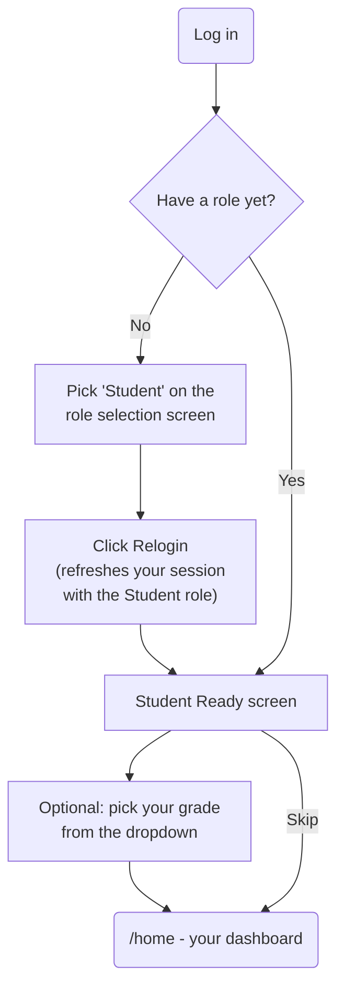
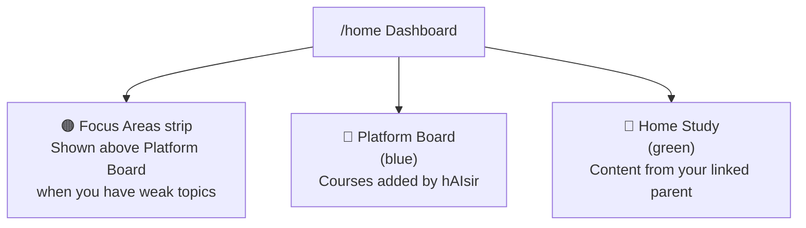
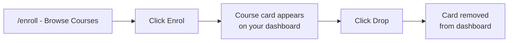
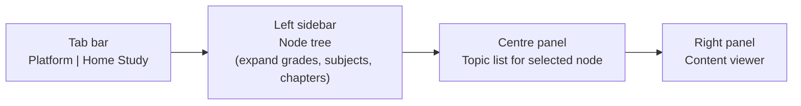
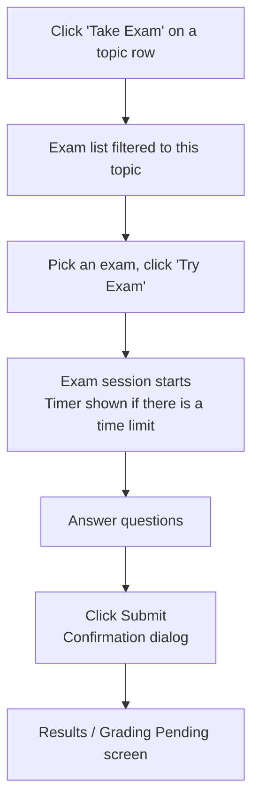
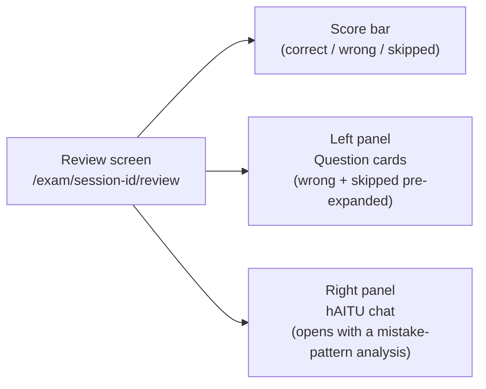
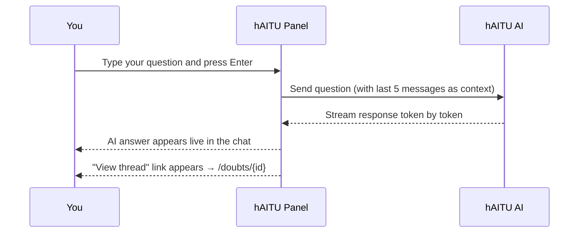
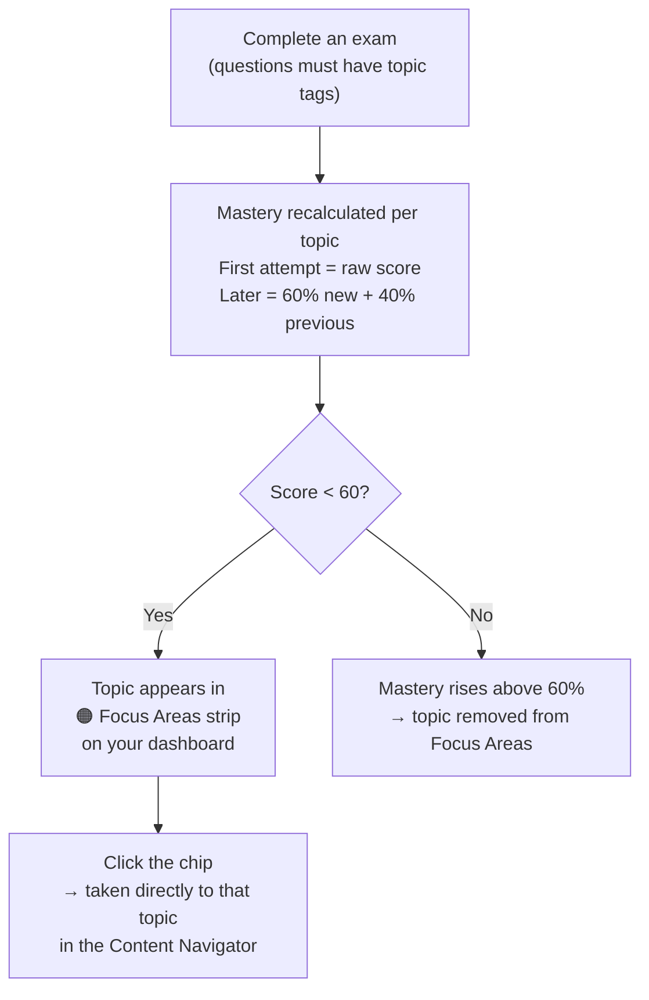
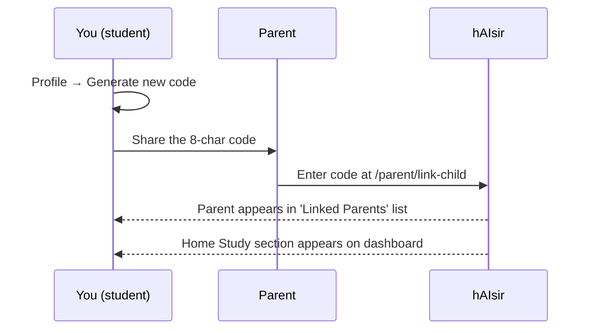

# Student User Guide

> Role: **Student** — study platform content, Home Study material from your parent, take exams, and ask hAITU for help.

---

## Contents

1. [Getting started — setting up your account](#1-getting-started--setting-up-your-account)
2. [Your dashboard](#2-your-dashboard)
3. [Enrolling in courses](#3-enrolling-in-courses)
4. [Studying content](#4-studying-content)
5. [Taking an exam](#5-taking-an-exam)
6. [After you submit — results and review](#6-after-you-submit--results-and-review)
7. [Asking hAITU for help](#7-asking-haitu-for-help)
8. [Your doubt inbox](#8-your-doubt-inbox)
9. [Focus Areas — weak topics](#9-focus-areas--weak-topics)
10. [Notifications](#10-notifications)
11. [Your profile and linking a parent](#11-your-profile-and-linking-a-parent)

---

## 1. Getting started — setting up your account

When you first log in, hAIsir walks you through a short onboarding flow.

Setting your grade on the Ready screen helps the platform mark relevant courses as **Recommended** for you on the Browse Courses page.

---

## 2. Your dashboard

Your dashboard (`/home`) is divided into two sections.

| Section | What it shows |
|---|---|
| **Focus Areas** (orange strip) | Topics where your mastery score is below 60 — appears only when you have weak topics. Each chip links directly to that topic. |
| **Platform Board** (blue) | Course cards for every platform board you are enrolled in. |
| **Home Study** (green) | Cards from your parent's private curriculum — only shown if a parent has linked to your account. |

Click any card to open the **Content Navigator** for that course.

---

## 3. Enrolling in courses

Before Platform Board content appears on your dashboard, you need to **enrol** in a course.

1. Click **Browse Courses** in the top navigation.
2. Browse the course cards. Your grade's courses are marked **Recommended**.
3. Click **Enrol** on any card to add it to your dashboard.
4. Click **Drop** to remove it.

You can enrol in and drop courses at any time. Dropping a course does not delete your exam history.

---

## 4. Studying content

Navigate to **a course card on your dashboard** or go to `/courses` directly. You will see a three-panel layout.

### Switching between Platform and Home Study

- **Platform tab** — courses added by hAIsir administrators.
- **Home Study tab** — content your parent has created for you. This tab is greyed out if no parent is linked.

### Navigating the node tree

Click a node in the left sidebar to expand it. Keep expanding until you reach a leaf node (a chapter, topic list, etc.) that shows topics in the centre panel.

- Clicking a node **label** selects it and expands it — it does not collapse.
- Clicking the **▶ chevron** toggles collapse/expand.

### Reading content

Click a topic in the centre panel to load its content in the right panel. Topics can contain:

- **Videos** — embedded YouTube or Vimeo player.
- **Text / notes** — formatted markdown, including tables and code.
- **Extracted text** — notes uploaded as PDF or images by the admin or your parent, shown as readable text with a source reference.

When a topic is open, the **hAITU panel** appears below the content — see [Asking hAITU for help](#7-asking-haitu-for-help).

---

## 5. Taking an exam

When a topic has an exam linked to it, a **Take Exam** button appears in the topic row of the centre panel.

### Question types

| Type | How to answer |
|---|---|
| **Single choice** | Select one option |
| **Multiple choice** | Select all correct options |
| **True / False** | Select True or False |
| **Fill in the blank** | Type a short phrase |
| **One-word response** | Type a single word |
| **Essay** | Write your answer in the text area; a hint shows the expected length based on essay type |
| **Matching** | Match items in the left column to items in the right column (right column is shuffled each session) |
| **Problem solving** | Enter your final answer; a working area appears if the exam requires shown working |

### Timer

If the exam has a time limit, a countdown timer is shown at the top. When the timer runs out the exam is automatically submitted with whatever you have answered so far.

### Resuming an unfinished exam

If you close the browser mid-exam and come back, the exam page automatically detects your unfinished session and resumes from where you left off.

---

## 6. After you submit — results and review

### Immediately after submitting

Two outcomes are possible depending on the exam type:

**Immediately scored exam** (no essays, or essays with AI grading already complete):

A "Submitted!" banner appears with two buttons:
- **Review answers** — opens the full post-exam review screen (S05).
- **View Attempts** — opens the attempts list for this exam.

**Exam with essays pending AI grading:**

A "Grading Pending" banner appears while the AI grades your essay questions. Two buttons:
- **View Attempts** — the graded attempt will appear here once grading finishes.
- **Back to Exams** — returns to the exam list.

### Viewing past attempts

Click **View Attempts** on any exam to see all your sessions for that exam. Each row shows the score and date. Click **View** on any completed attempt to open the review screen.

### Post-exam AI review (S05)

The review screen shows every question with feedback and lets you chat with hAITU about your mistakes.

**Question card colours:**
- Green ✓ — correct
- Red ✗ — wrong
- Grey — skipped
- Amber ⏳ — essay pending grading

**For wrong answers** each card shows the correct answer, a pre-written explanation, and AI feedback (for essay questions). You can also click **"Ask hAITU to explain this"** on any wrong question to get a tailored explanation in the chat panel.

**hAITU pattern analysis:** when the review screen loads, hAITU automatically analyses your mistakes and posts an opening message identifying the main pattern (e.g. "You consistently misidentified fractions greater than 1"). You can continue the conversation by typing follow-up questions.

**Your review conversation is saved.** If you close the review screen and come back to the same attempt later, the chat reloads with everything you and hAITU said before — you don't start over. The opening pattern-analysis message is regenerated each visit rather than stored, so only your actual conversation is restored.

### Essay grading states

| What you see | Meaning |
|---|---|
| ⏳ Grading in progress… | AI is still processing |
| Pending review | Exam set to manual release — your parent/admin will confirm the score |
| Score + AI Feedback | Grading complete, score released |
| Under review | You (or someone) disputed the score; owner is reviewing |
| Score confirmed | Owner confirmed the AI score |

---

## 7. Asking hAITU for help

**hAITU** is the platform's AI tutor. You can ask it questions about any topic you are studying.

The hAITU panel appears at the bottom of the content viewer when you open a topic.

### Things to know

- **Enrolment required for Platform courses** — if you are not enrolled in the course, the panel shows "Enrol in this course to ask hAITU questions." Go to Browse Courses to enrol.
- **Home Study topics** — available without enrolment as long as your parent is actively linked.
- **Rate limit** — you can ask up to 20 questions per hour. If you hit the limit you will see "You've reached the AI limit for this hour. Try again later."
- **Persistent thread** — every question you ask is saved. The panel shows a "View thread" link after each response so you can re-read the conversation later from your Doubt Inbox.
- **Ask your teacher** — if hAITU's answer doesn't help, click **"Ask your teacher"** to escalate the doubt to an instructor. This button is only available for Platform course topics (not Home Study topics) and only when the doubt is still open.

---

## 8. Your doubt inbox

All your hAITU conversations are saved as **doubt threads** accessible from **My Doubts** (`/doubts`) in the navigation bar.

### Doubt inbox (S08)

Each row shows:
- The question title and topic name.
- A **status chip** showing where the doubt stands.
- When it was last active.

| Status | Meaning |
|---|---|
| New | Just asked — no response yet |
| AI Answered | hAITU has replied |
| Escalated | Sent to a teacher for help |
| Answered | A teacher has replied |
| Resolved / Closed | Thread is closed (auto-closes after 7 days of no activity) |

Use the **filter** above the list (All / New / Escalated / Answered / Resolved) to narrow down threads.

### Doubt thread (S09)

Click any row to open the full thread. The conversation is displayed as a chat:
- Your messages on the right (blue for Platform topics, green for Home Study topics).
- hAITU's messages on the left.
- Teacher replies in a distinct teacher style.
- System notes (e.g. "Escalated to a teacher") centred in the thread.

You can send **follow-up questions** from the composer at the bottom of the thread.

To escalate to a teacher, click **"Request teacher help"** — visible when the status is **New** or **AI Answered**.

---

## 9. Focus Areas — weak topics

After you complete an exam, hAIsir tracks your score for each topic. If your mastery for a topic falls below 60%, it is marked as **weak** and appears in the **Focus Areas** strip on your dashboard.

**Note:** mastery is only tracked for questions that have a topic tag assigned by the exam author. If an exam has no topic tags on its questions, it won't contribute to mastery tracking.

---

## 10. Notifications

The **bell icon** in the top navigation bar shows a badge when you have unread notifications.

Click the bell to open a dropdown showing your most recent unread items. From there you can:
- Click an item to go to the relevant page and mark it as read.
- Click **Mark all read** to clear the badge.
- Click **View all** to go to the full notifications page (`/notifications`).

On the full notifications page, use the **Unread only** toggle to filter, and the **Mark all read** button to clear everything at once.

### Notification types you will receive

| Notification | When you get it |
|---|---|
| Topic marked weak | After an exam, if a topic's mastery drops below 60% |
| Teacher replied | A teacher has answered your escalated doubt |
| Doubt auto-closed | A doubt thread was automatically closed after 7 days of inactivity |

---

## 11. Your profile and linking a parent

Go to **Profile** in the navigation bar (`/profile`) to manage your account and parent links.

### Generating a link code for your parent

Your parent needs a **link code** from you to connect to your account. The code grants them access to create Home Study content for you.

1. On your Profile page, find the **Parent Access** section.
2. Click **Generate new code** — an 8-character code appears.
3. Copy the code (click the copy button) and share it with your parent.
4. The code expires in **72 hours** and can only be used once. Generating a new code cancels any previous unused code.

### Viewing and revoking linked parents

The **Linked Parents** section of your Profile lists all parents currently connected to your account. Click **Remove** next to a parent's name to revoke their access immediately. This also hides their Home Study content from you.

You can have multiple parents linked (for example, both parents can link independently).
