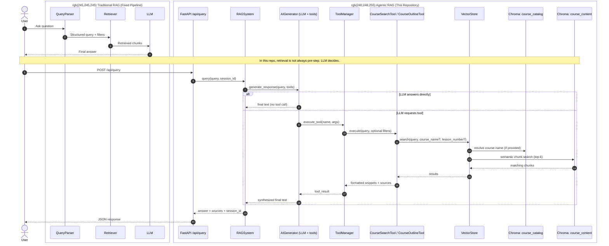

# Traditional RAG vs Agentic RAG (This Codebase)

```mermaid
sequenceDiagram
    autonumber
    actor U as User

    box rgb(245,245,245) Traditional RAG (Fixed Pipeline)
    participant TQP as QueryParser
    participant TR as Retriever
    participant TLLM as LLM
    end

    box rgb(240,248,255) Agentic RAG (This Repository)
    participant API as FastAPI /api/query
    participant RS as RAGSystem
    participant AIG as AIGenerator (LLM + tools)
    participant TM as ToolManager
    participant CST as CourseSearchTool / CourseOutlineTool
    participant VS as VectorStore
    participant CC as Chroma: course_catalog
    participant CT as Chroma: course_content
    end

    U->>TQP: Ask question
    TQP->>TR: Structured query + filters
    TR->>TLLM: Retrieved chunks
    TLLM-->>U: Final answer

    Note over U,CT: In this repo, retrieval is not always pre-step. LLM decides.

    U->>API: POST /api/query
    API->>RS: query(query, session_id)
    RS->>AIG: generate_response(query, tools)

    alt LLM answers directly
        AIG-->>RS: final text (no tool call)
    else LLM requests tool
        AIG->>TM: execute_tool(name, args)
        TM->>CST: execute(query, optional filters)
        CST->>VS: search(query, course_name?, lesson_number?)
        VS->>CC: resolve course name (if provided)
        VS->>CT: semantic chunk search (top-k)
        CT-->>VS: matching chunks
        VS-->>CST: results
        CST-->>TM: formatted snippets + sources
        TM-->>AIG: tool_result
        AIG-->>RS: synthesized final text
    end

    RS-->>API: answer + sources + session_id
    API-->>U: JSON response
```
