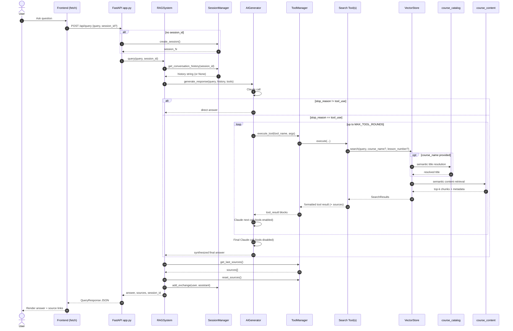

# Main Request Sequence (Actual Flow in This Repo)

```mermaid
sequenceDiagram
    autonumber
    actor U as User
    participant F as Frontend (fetch)
    participant API as FastAPI app.py
    participant RS as RAGSystem
    participant SM as SessionManager
    participant AIG as AIGenerator
    participant TM as ToolManager
    participant ST as Search Tool(s)
    participant VS as VectorStore
    participant CC as course_catalog
    participant CT as course_content

    U->>F: Ask question
    F->>API: POST /api/query {query, session_id?}

    alt no session_id
        API->>SM: create_session()
        SM-->>API: session_N
    end

    API->>RS: query(query, session_id)
    RS->>SM: get_conversation_history(session_id)
    SM-->>RS: history string (or None)

    RS->>AIG: generate_response(query, history, tools)
    AIG->>AIG: Claude call #1 (tools enabled)

    alt stop_reason != tool_use
        AIG-->>RS: direct answer
    else stop_reason == tool_use
        loop up to MAX_TOOL_ROUNDS
            AIG->>TM: execute_tool(tool_name, args)
            TM->>ST: execute(...)
            ST->>VS: search(query, course_name?, lesson_number?)
            opt course_name provided
                VS->>CC: semantic title resolution
                CC-->>VS: resolved title
            end
            VS->>CT: semantic content retrieval
            CT-->>VS: top-k chunks + metadata
            VS-->>ST: SearchResults
            ST-->>TM: formatted tool result (+ sources)
            TM-->>AIG: tool_result blocks
            AIG->>AIG: Claude next call (tools enabled)
        end
        AIG->>AIG: Final Claude call (tools disabled)
        AIG-->>RS: synthesized final answer
    end

    RS->>TM: get_last_sources()
    TM-->>RS: sources[]
    RS->>TM: reset_sources()

    RS->>SM: add_exchange(user, assistant)
    RS-->>API: answer, sources, session_id
    API-->>F: QueryResponse JSON
    F-->>U: Render answer + source links
```
