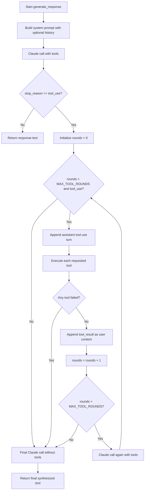

# Tool-Loop Activity (AIGenerator)

```mermaid
flowchart TD
    A[Start generate_response] --> B[Build system prompt with optional history]
    B --> C[Claude call with tools]

    C --> D{stop_reason == tool_use?}
    D -- No --> E[Return response text]

    D -- Yes --> F[Initialize rounds = 0]
    F --> G{rounds < MAX_TOOL_ROUNDS and tool_use?}

    G -- No --> N[Final Claude call without tools]
    N --> O[Return final synthesized text]

    G -- Yes --> H[Append assistant tool-use turn]
    H --> I[Execute each requested tool]
    I --> J{Any tool failed?}

    J -- Yes --> N
    J -- No --> K[Append tool_result as user content]
    K --> L[rounds = rounds + 1]
    L --> M{rounds < MAX_TOOL_ROUNDS?}

    M -- Yes --> P[Claude call again with tools]
    P --> G

    M -- No --> N
```
