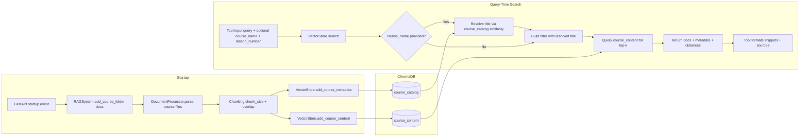

# Data and Ingestion Flow

```mermaid
flowchart LR
    subgraph Startup
        A[FastAPI startup event] --> B[RAGSystem.add_course_folder docs]
        B --> C[DocumentProcessor.parse course files]
        C --> D[Chunking chunk_size + overlap]
        D --> E[VectorStore.add_course_metadata]
        D --> F[VectorStore.add_course_content]
    end

    subgraph ChromaDB
        G[(course_catalog)]
        H[(course_content)]
    end

    E --> G
    F --> H

    subgraph Query-Time Search
        Q[Tool input query + optional course_name + lesson_number] --> R[VectorStore.search]
        R --> S{course_name provided?}
        S -- Yes --> T[Resolve title via course_catalog similarity]
        T --> U[Build filter with resolved title]
        S -- No --> U
        U --> V[Query course_content for top-k]
        V --> W[Return docs + metadata + distances]
        W --> X[Tool formats snippets + sources]
    end

    G --> T
    H --> V
```
