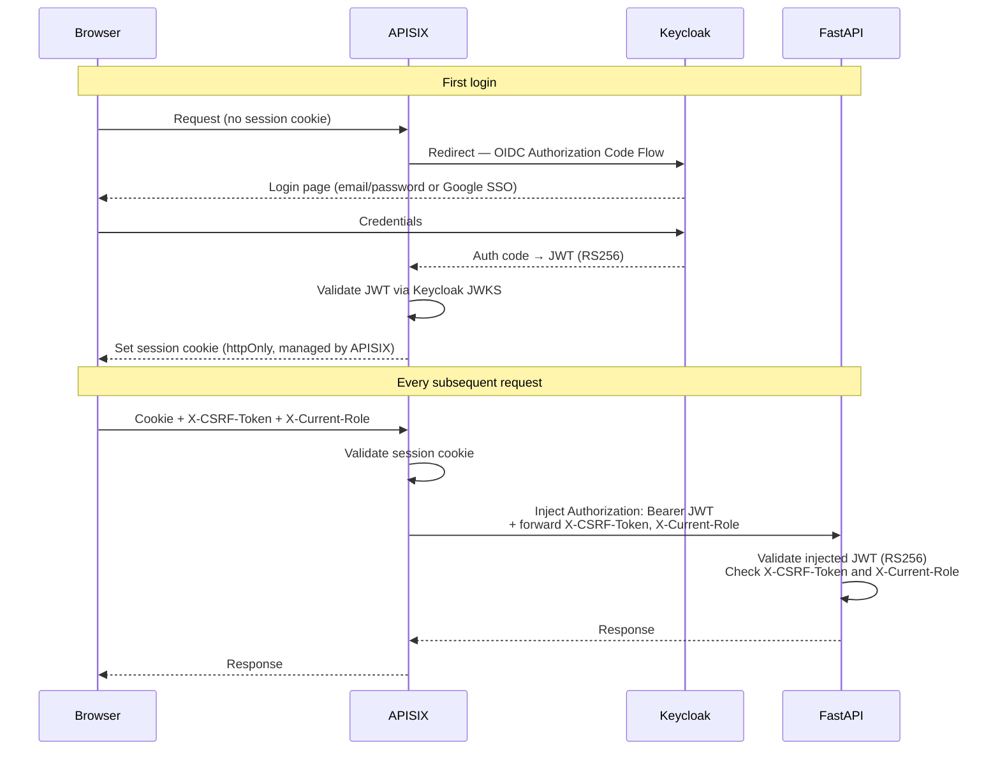
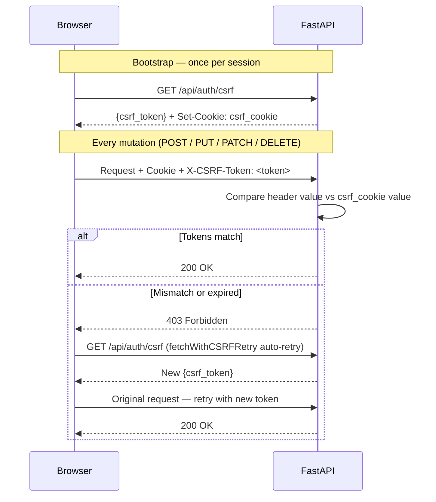
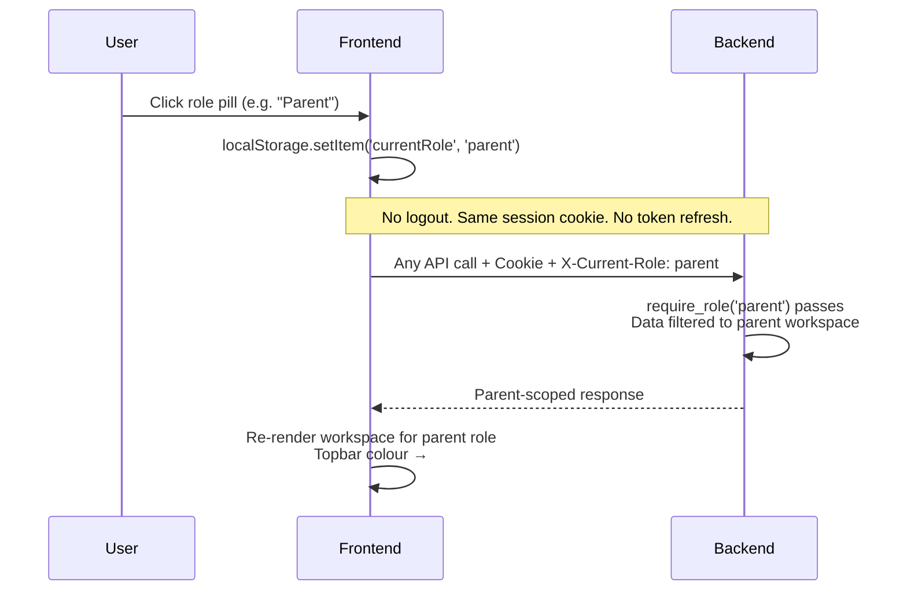

# hAIsir — Auth and Roles
> Version 1.1 | Updated to reflect actual baseline from `haisir_current.md`.
> → Depends on: `00_overview.md`, `01_data_model.md`

---

## 1. Auth Architecture

**This is the most important thing to understand before writing any auth code.**

APISIX is the single entry point for all traffic. The frontend and backend **never communicate directly**. Auth is handled entirely at the gateway layer:

```
Browser
  → Cloudflare CDN/Tunnel
    → APISIX Gateway (port 9080/443)
        ├── Coraza WASM WAF (OWASP CRS v4)
        ├── CrowdSec Bouncer
        ├── OIDC plugin → Keycloak 26 (Google SSO supported)
        └── On successful auth:
            ├── Sets session cookie on browser
            └── Injects: Authorization: Bearer <JWT> upstream to FastAPI
                        (FastAPI never receives auth from the client directly)
```

**What the client sends on every request:**
```
Cookie: <session_cookie>          # set by APISIX, managed by browser
X-CSRF-Token: <csrf_token>        # double-submit CSRF pattern
X-Current-Role: student           # active role context (see section 4)
```

**What FastAPI receives on every request (injected by APISIX):**
```
Authorization: Bearer <JWT>       # injected by APISIX, NOT sent by client
X-CSRF-Token: <csrf_token>        # forwarded from client
X-Current-Role: student           # forwarded from client
```

FastAPI validates the JWT that APISIX injects — not anything from the browser. Developers must never write code that expects the client to send a Bearer token.

The following diagram shows the full request lifecycle — first login through steady-state requests:



---

## 2. Keycloak Configuration

| Setting | Value |
|---|---|
| Realm | `haisir-realm-{{APP_ENV}}` (e.g. `haisir-realm-staging`, `haisir-realm-prod`) |
| Auth flow | OIDC / OAuth 2.0 Authorization Code Flow |
| Token type | JWT (RS256) |
| SSO providers | Google (configured as identity provider) |
| User self-registration | Disabled in Keycloak realm config (`registrationAllowed: false`). New accounts are created via Google SSO, Keycloak Admin API (for institution admins and invited teachers), or the onboarding flow's role assignment endpoint. |
| JWT validation | FastAPI validates RS256 against Keycloak JWKS endpoint |

### 2.1 Realm Roles — Existing vs New

**Existing roles (already in Keycloak — do not recreate):**

| Role | Description |
|---|---|
| `student` | Can study, take quizzes and exams |
| `instructor` | Institutional teacher — manages classes, creates quizzes and exams |
| `admin` | Platform administrator — full access. Maps to the SuperAdmin persona in the new UI. |

**New roles (to be added to Keycloak):**

| Role | Description |
|---|---|
| `institution_admin` | Manages institution, curriculum, teachers, students |
| `tutor` | Independent tutor — owns curriculum, manages own students async |
| `parent` | Read-only — tracks linked child's progress |

**Important:** The existing `admin` role is the SuperAdmin persona. Do not create a `superadmin` role — extend the existing `admin` role with new screens and capabilities.

A single Keycloak account can hold multiple roles simultaneously. This mechanism already exists in the codebase via `X-Current-Role`. All non-admin role combinations are allowed (see `11_role_migration.md` §8 for the full matrix). The `admin` role must not be combined with any other role — see BR-ROLE-004.

### 2.2 JWT Claims Used

FastAPI reads the following from the Keycloak JWT (which APISIX injects):

```json
{
  "sub": "uuid-string",
  "email": "user@example.com",
  "email_verified": true,
  "realm_access": {
    "roles": ["student", "instructor"]
  }
}
```

The active role context is NOT in the JWT — it comes from the `X-Current-Role` request header.

### 2.3 Role Assignment Rules

| Role | How assigned |
|---|---|
| `student` | Auto-assigned on self-registration via onboarding flow (new) |
| `instructor` | Invited by `institution_admin` via email/userid — never self-assigned |
| `admin` | Assigned manually in Keycloak console — never through the application |
| `institution_admin` | New — assigned by `admin` only, never self-registered |
| `tutor` | New — auto-assigned on self-registration; marketplace listing is immediate on toggle (federated model, no approval gate), admin can suspend post-hoc |
| `parent` | New — auto-assigned on self-registration |

---

## 3. CSRF Protection

The existing codebase uses `fastapi-csrf-protect` with the double-submit cookie pattern. **All new endpoints must follow this existing pattern.**

### 3.1 How it works

1. Client calls `GET /api/auth/csrf` to receive a CSRF token (this endpoint already exists).
2. Token is stored client-side and sent as `X-CSRF-Token` header on every state-changing request (POST, PUT, PATCH, DELETE).
3. FastAPI validates the token matches the cookie value on each request.
4. On 403 (token expired or mismatch), the existing `fetchWithCSRFRetry()` wrapper automatically fetches a fresh token and retries once.



### 3.2 Frontend convention

All API calls use raw `fetch` — no Axios, no third-party HTTP client. Every request follows this existing pattern:

```typescript
const response = await fetch('/api/some-endpoint', {
  method: 'POST',
  credentials: 'include',           // session cookie
  headers: {
    'Content-Type': 'application/json',
    'X-CSRF-Token': csrfToken,       // from useAuth hook
    'X-Current-Role': activeRole,    // from useAuth hook
  },
  body: JSON.stringify(payload),
});
```

Use `fetchWithCSRFRetry()` (already in codebase) for any mutation that could fail on a stale CSRF token. All new frontend code must follow this pattern exactly.

### 3.3 Backend convention

All new FastAPI routes that mutate state must include CSRF validation via the existing `Depends` factory in `auth/csrf.py`. Do not roll custom CSRF logic in route files.

---

## 4. Role Switching

### 4.1 How it works

The role switching mechanism already exists. A user with multiple roles switches context via the topbar UI. The switch:
1. Updates the active role in `localStorage`
2. Sets `X-Current-Role` header on all subsequent requests
3. Does NOT log the user out or require re-authentication

The existing `useAuth` hook manages this. New roles (`tutor`, `institution_admin`, `parent`) must integrate into the existing `useAuth` hook — not a new one.



### 4.2 `X-Current-Role` header

> ⚠ Note: Earlier documentation incorrectly used `X-Active-Role`. The correct header name throughout the codebase is `X-Current-Role`.

The backend enforces `X-Current-Role` on every request. The existing auth layer in `auth/roles.py` already handles `student`, `instructor`, `admin`. Extend it for new roles:

```python
# Existing pattern in auth/roles.py — extend, do not replace
def require_role(required_role: str):
    def dependency(current_user: CurrentUser = Depends(get_current_user)):
        if current_user.current_role != required_role:
            raise HTTPException(403, "Active role does not match required role")
        if required_role not in current_user.roles:
            raise HTTPException(403, "User does not hold this role")
        return current_user
    return dependency
```

**BR-SEC-006:** `X-Current-Role` should be sent with every request. If missing, the backend defaults to the user's first available role — but the frontend must always send it explicitly to avoid ambiguity. See section 7 for the small set of explicit exceptions.

### 4.3 `institution_admin` + `instructor` dual role

An institution admin who also teaches holds both roles. When they switch to `X-Current-Role: instructor`, the teacher workspace is scoped to their own organization — they see only their own classes.

---

## 4.4 Token Refresh After Role Assignment

During onboarding, the backend assigns new Keycloak roles via `POST /api/users/me/assign-role`. Because the user's existing JWT was issued before the role existed, the JWT must be refreshed before the new role appears in `realm_access.roles`.

**Token refresh is automatic — there is no explicit `/api/auth/refresh` route.**

APISIX's OIDC plugin is configured with `renew_access_token_on_expiry: true` and the `offline_access` scope, which means:
- When the access token expires (300s lifespan), APISIX automatically uses the stored refresh token to obtain a new access token from Keycloak
- The session cookie is updated transparently — no client action required for normal token expiry

**After role assignment during onboarding**, the new role won't appear in the current JWT until it expires and APISIX auto-refreshes. To force an immediate refresh, use Keycloak's silent re-authentication:

```typescript
// After POST /api/users/me/assign-role, force token refresh:
// Option 1: Hidden iframe with prompt=none (preferred)
const iframe = document.createElement('iframe');
iframe.style.display = 'none';
iframe.src = '/auth/login?prompt=none';
document.body.appendChild(iframe);
iframe.onload = () => {
  document.body.removeChild(iframe);
  // Session cookie now contains JWT with updated realm_access.roles
  await refreshUser(); // re-fetch /api/users/me
};

// Option 2: Full-page redirect (fallback if iframe blocked by third-party cookie policies)
window.location.href = '/auth/login?prompt=none&redirect_uri=' + encodeURIComponent(window.location.href);
```

> **Browser compatibility note:** Safari (ITP) and Firefox (ETP in strict mode) block third-party cookies, which causes the hidden iframe silent refresh to fail silently — the Keycloak session cookie is treated as third-party in the iframe context. The frontend must detect iframe refresh failure (e.g., iframe `onerror` or timeout after 3 seconds) and fall back to Option 2 (full-page redirect with `prompt=none`). This is transparent to the user — Keycloak re-authenticates using the existing session and redirects back immediately.

**BR-AUTH-001:** The frontend must trigger a token refresh after every successful `POST /api/users/me/assign-role` during onboarding before proceeding to the next screen. This ensures `realm_access.roles` in the JWT reflects the newly assigned role before `X-Current-Role` is set for that role.

---

## 5. FastAPI Auth Layer

### 5.1 Existing folder structure (do not restructure)

```
auth/
  jwt.py          → JWT validation against Keycloak JWKS (RS256)
  csrf.py         → CSRF token validation (fastapi-csrf-protect)
  roles.py        → Role Depends factories
```

All new endpoints use `Depends` from `auth/roles.py`. No auth logic in route files.

### 5.2 Backend folder structure (DDD — do not deviate)

```
api/routes/          → HTTP layer (routers only)
domain/models/       → Pure Python dataclasses (zero ORM imports)
domain/services/     → Business logic
domain/repositories/ → Abstract interfaces
infrastructure/      → Concrete SQLAlchemy repos + imperative mapping
schemas/             → Pydantic v2 request/response models
auth/                → JWT, CSRF, role decorators
```

SQLAlchemy uses **imperative (classical) mapping** — domain models are plain dataclasses, not ORM subclasses. All new models must follow this pattern.

### 5.3 Middleware stack (existing — do not modify)

```
ProxyHeaders → SecurityHeaders → SecurityValidation (content-type, 10MB limit, file type/size)
→ request ID + structured logging (structlog)
```

### 5.4 CurrentUser model

```python
# Extend existing CurrentUser — do not replace
@dataclass
class CurrentUser:
    sub: str                    # IdP sub claim (currently Keycloak)
    email: str | None
    name: str | None            # from Keycloak 'name' claim
    email_verified: bool
    roles: list[str]            # all roles this user holds (filtered to valid UserRole values)
    current_role: UserRole | None  # from X-Current-Role header; defaults to first role if not provided
```

---

## 6. Permission Matrix

### 6.1 Student (`student` — existing role, extended)

| Resource | Read | Write |
|---|---|---|
| Own profile | ✓ | ✓ |
| `course_path_nodes` (within enrollment) | ✓ | ✗ |
| `topic_contents` (within enrollment) | ✓ | ✗ |
| Own `exam_sessions` (quiz + exam) | ✓ | ✓ (submit only) |
| Other students' attempts/sessions | ✗ | ✗ |
| Own doubts (new) | ✓ | ✓ (create, message, resolve) |
| Own notifications (new) | ✓ | ✓ (mark read) |
| Own parent link code (new) | ✓ | ✓ (generate) |
| Tutor marketplace profiles (new) | ✓ | ✗ |

### 6.2 Instructor (`instructor` — existing role, extended)

| Resource | Read | Write |
|---|---|---|
| Own teacher profile | ✓ | ✓ |
| `exam_templates` (own + class-scoped, quiz + exam) | ✓ | ✓ (create, edit, assign) |
| `questions` + `paragraph_questions` | ✓ | ✓ (create, edit own) |
| `exam_sessions` (class only) | ✓ | ✗ |
| Students in assigned classes | ✓ | ✗ |
| Student progress (class only) | ✓ | ✗ |
| Doubts escalated to them (new) | ✓ | ✓ (respond, resolve) |
| `topic_contents` — supplemental additions (new) | ✓ | ✓ (add only) |
| `course_path_nodes` | ✓ | ✗ (read only — institution_admin owns structure) |
| Own notifications (new) | ✓ | ✓ (mark read) |

### 6.3 Admin (`admin` — existing role, extended with new SuperAdmin capabilities)

Full read/write on all existing resources. New capabilities added:

- Publish and manage board content (`course_path_nodes` with `owner_type = 'platform'`)
- Approve / reject institution registrations
- Suspend / restore tutor marketplace listings
- Suspend / restore any user via Keycloak Admin API
- Toggle platform-wide feature flags (`platform_settings` — new table)
- View platform-wide AI resolution rate analytics

### 6.4 Institution Admin (`institution_admin` — new role)

| Resource | Read | Write |
|---|---|---|
| Own organization | ✓ | ✓ |
| All classes in org | ✓ | ✓ (create, assign teacher, enroll students) |
| All students in org (aggregate only) | ✓ | ✓ (enroll, remove) |
| All instructors in org | ✓ | ✓ (invite, assign to class) |
| `course_path_nodes` (org-owned, `owner_type = 'institution'`) | ✓ | ✓ |
| `course_path_nodes` (platform-owned, `owner_type = 'platform'`) | ✓ | ✗ |
| `topic_contents` (org-owned) | ✓ | ✓ |
| Class-level analytics | ✓ | ✗ |
| Individual student exam/quiz answers | ✗ | ✗ |
| Individual doubt message content | ✗ | ✗ |
| Doubt escalation metrics (aggregate only) | ✓ | ✗ |
| Own notifications | ✓ | ✓ (mark read) |

**BR-ADMIN-001:** Institution admins can see individual student names, mastery scores, and progress (via I06/T02 read-only view), but never individual student quiz/exam answers or doubt message content. They see doubt counts and status per student, not the actual messages.

### 6.5 Tutor (`tutor` — new role)

| Resource | Read | Write |
|---|---|---|
| Own teacher profile | ✓ | ✓ |
| Own `course_path_nodes` (`owner_type = 'tutor'`) | ✓ | ✓ |
| Own `topic_contents` | ✓ | ✓ |
| Own `questions` + `paragraph_questions` | ✓ | ✓ |
| Own `exam_templates` (quiz + exam) | ✓ | ✓ |
| Own students' progress | ✓ | ✗ |
| Doubts escalated to them | ✓ | ✓ (respond, resolve) |
| Tutor-student relationships | ✓ | ✓ (manage own) |
| Marketplace profile | ✓ | ✓ (edit; immediately visible on toggle — admin can suspend post-hoc) |
| Own notifications | ✓ | ✓ (mark read) |

### 6.6 Parent (`parent` — new role)

| Resource | Read | Write |
|---|---|---|
| Own parent profile | ✓ | ✓ |
| Linked child's enrollment progress | ✓ | ✗ |
| Linked child's quiz/exam result scores (not questions) | ✓ | ✗ |
| Linked child's doubt status + teacher responses | ✓ | ✗ |
| Linked child's activity timeline | ✓ | ✗ |
| Tutor profiles of child's tutors | ✓ | ✗ |
| Message thread with child's tutors | ✓ | ✓ (send messages) |
| Other children's data | ✗ | ✗ |
| Child's quiz/exam questions | ✗ | ✗ |
| Own notifications | ✓ | ✓ (mark read) |

**BR-PARENT-005:** Parents can message tutors directly. They cannot message institutional teachers — contact goes through the institution.

---

## 7. Security Rules

**BR-SEC-001:** All API endpoints require a valid JWT (APISIX-injected). The only unauthenticated endpoints are `/api/health` and Keycloak-managed OIDC endpoints.

**BR-SEC-002:** Students get 404 (not 403) when querying another student's data — do not reveal existence of other users' resources.

**BR-SEC-003:** Instructors can only access students in their assigned classes. Tutors can only access their own tutor-student relationships.

**BR-SEC-004:** Parent access to child data requires an active `parent_child_links` record (`status = 'linked'`). Revoked links remove access immediately on the next request.

**BR-SEC-005:** Institution admins can only manage data within their own organization. Cross-org access returns 403.

**BR-SEC-006:** `X-Current-Role` should be sent with every request. If missing, the backend defaults to the user's first available role — but the frontend must always send it explicitly to avoid ambiguity. **Exceptions** (endpoints that accept requests without this header): `GET /api/users/me`, `PATCH /api/users/me/onboarding-complete`, `POST /api/users/me/assign-role` — these are called during or immediately after onboarding before the user has an active role.

**BR-SEC-007:** JWT public key caching — APISIX caches JWKS for 24 hours (`jwk_expires_in: 86400`). The backend PyJWKClient uses library-default caching. Rotate Keycloak signing keys with at least 24 hours overlap to avoid validation failures.

**BR-SEC-008:** Never log JWT contents, CSRF tokens, or session cookies. Use `structlog` with sensitive field redaction as established in the existing middleware stack.

**BR-SEC-009:** `POST /api/users/me/assign-role` only accepts `student` or `parent`. All other roles must return HTTP 403:
- `instructor` — invited by institution_admin via `POST /api/admin/invite-role`
- `tutor` — explicit registration via `POST /api/users/me/become-tutor`
- `institution_admin` — assigned by platform admin via backend IdP Admin service client
- `admin` — dedicated accounts, assigned manually via IdP console
See `11_role_migration.md` §3.2 and §4.5 for full assignment flows.

---

## 8. Notification Type — Role Routing

> **Canonical definition:** `10_notifications.md` is the authoritative source for notification types, generation triggers, and cron schedules. The table below is a quick-reference routing summary only. If the two files conflict, `10_notifications.md` takes precedence.

| NotificationType | Delivered to role |
|---|---|
| `doubt_teacher_replied` | `student` |
| `assignment_due_soon` | `student` |
| `quiz_results_ready` | `student` |
| `exam_results_ready` | `student` |
| `topic_marked_weak` | `student` |
| `new_content_uploaded` | `student` |
| `doubt_auto_closed` | `student` |
| `new_doubt_escalated` | `instructor` or `tutor` |
| `class_exam_submitted` | `instructor` |
| `student_at_risk` | `instructor` |
| `content_published` | `instructor` |
| `child_doubt_replied` | `parent` |
| `child_assignment_due` | `parent` |
| `child_weekly_digest` | `parent` |
| `child_streak_milestone` | `parent` |
| `child_doubt_auto_closed` | `parent` |
| `teacher_added_to_org` | `instructor` |
| `class_no_teacher` | `institution_admin` |
| `student_at_risk_admin` | `institution_admin` |
| `board_content_updated` | `institution_admin` |
| `institution_registration` | `admin` |
| `tutor_published` | `admin` |
| `haitu_resolution_dropped` | `admin` |
| `board_publish_confirmed` | `admin` |
