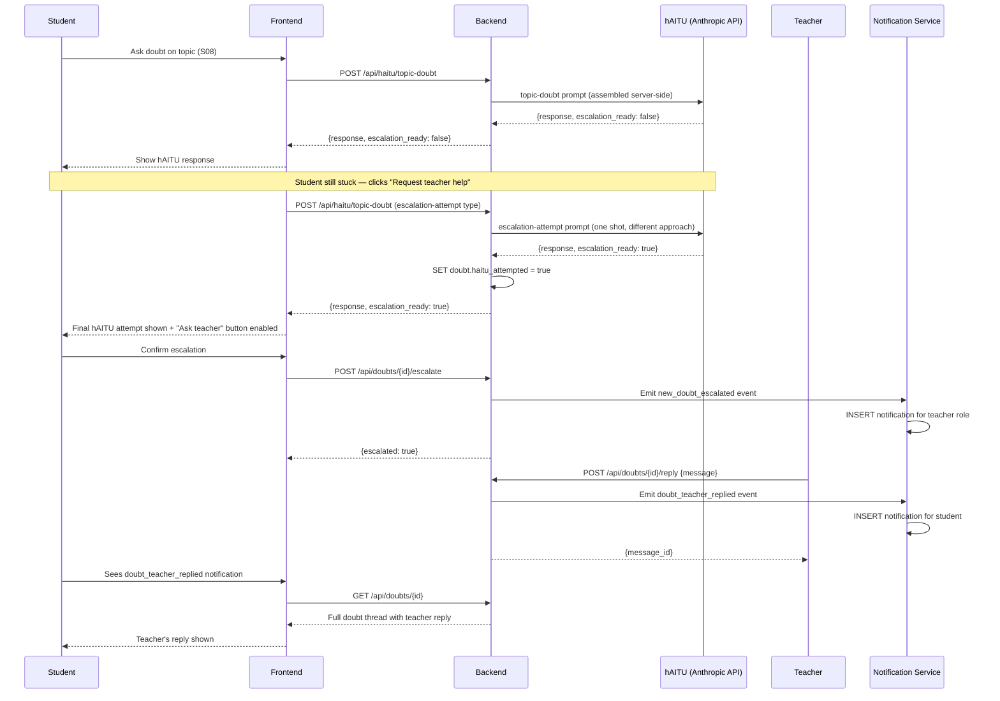

# hAIsir — hAITU AI Layer Specification
> Version 1.0 | All hAITU behaviours, prompt contracts, escalation logic, and API patterns.
> → Depends on: `00_overview.md` through `05_06_07_personas.md`
> → Model is configurable by SuperAdmin. Default: `claude-sonnet-4-6`

---

## 1. Overview

hAITU is the AI tutor embedded in hAIsir. It is not a general-purpose chatbot — it is scoped, contextual, and always acts in service of learning. Every hAITU interaction is associated with:

- A **user** (student, teacher, or parent)
- A **role context** (what kind of help is being requested)
- A **topic context** (which topic or quiz/exam the interaction is about)
- An **enrollment context** (which board / institution / tutor the content belongs to)

hAITU never operates without all of these. There is no global "ask hAITU anything" mode.

---

## 2. hAITU Interaction Types

| Type | Triggered by | Description |
|---|---|---|
| `topic-doubt` | Student asks doubt on a topic | Answers conceptual questions about a topic |
| `exam-review-chat` | Student in exam review screen | Discusses exam mistakes and patterns |
| `escalation-attempt` | Student clicks "Ask teacher" | hAITU makes one more attempt before flagging for teacher |
| `teacher-tools` | Teacher in student detail or curriculum | Generates session plans, practice questions, progress reports |
| `parent-topic-description` | Parent views progress tab | Generates plain-language topic status descriptions |
| `parent-report` | Parent clicks "Get report now" | Generates full plain-language progress summary |
| `parent-topic-explain` | Parent clicks "Explain this" on weak topic | Explains why topic is hard and what parent can do |
| `exam-analysis` | Teacher views exam results | Generates recommendations for next class |

---

## 3. Prompt Contracts

Each interaction type has a fixed system prompt and a defined input/output contract. These are described below. All prompts are assembled server-side — the client never sends raw prompt text.

---

### 3.1 `topic-doubt`

**When:** Student clicks "Ask hAITU" on a topic row, or types in the hAITU panel on the topic page.

**Context assembled server-side:**
- Topic title, level, subject, board
- Top-5 relevant chunks from `topic_content_chunks` — retrieved via pgvector (see retrieval pipeline below)
- Student's mastery score for this topic
- Last 5 messages from this topic's hAITU session (rolling window)

**RAG retrieval pipeline for `{content_summary}`:**
1. Embed the student's message using `all-MiniLM-L6-v2`.
2. Query `topic_content_chunks`:
   ```sql
   SELECT content FROM topic_content_chunks
   WHERE topic_id = :topic_id
   ORDER BY embedding <=> :query_embedding
   LIMIT 5;
   ```
3. Assemble the top-5 chunks (up to ~3000 chars total) as `{content_summary}` for the system prompt.

**Video-only fallback:** If `topic_content_chunks` is empty for the topic (e.g. video-only content with no PDF/text), fall back to `topic_contents.text_extracted` truncated to 4000 characters (BR-AI-010 behaviour preserved).

**Content ingestion pipeline (LlamaIndex):**
- On `topic_contents` create or update, an async background job is triggered.
- Extracted text is stored in `topic_contents.text_extracted` (see `01_data_model.md` section 6a) and chunked/embedded into `topic_content_chunks` (see section 6b).
- Chunks: 600-char pieces, 100-char overlap, sentence-aware split. Embedded with `all-MiniLM-L6-v2`.
- If a student asks a hAITU doubt before ingestion is complete, the backend returns a fallback response: "hAITU is still reviewing the materials for this topic — please try again in a moment." (HTTP 202 with `retry_after: 30` header).
- Extraction status is tracked via `topic_contents.extraction_status` (`'pending'` | `'complete'` | `'failed'`). No notification is sent to the student when extraction completes — the student simply retries and it works.
- Invalidation: any update to a `topic_contents` row resets `extraction_status = 'pending'` and re-triggers extraction + re-chunking.

**System prompt template:**
```
You are hAITU, an AI tutor for {subject} at {grade} level on the {board} curriculum.
The student is studying: "{topic_title}".
Their current mastery score is {mastery_score}% — {"they are struggling" if <60, "they are progressing" if 60-75, "they are doing well" if >75}.

Available topic content:
{content_summary}

Rules:
- Answer only questions related to this topic. If asked something off-topic, redirect kindly.
- Use simple language appropriate for a Grade {grade} student.
- Use examples from everyday Indian life where possible.
- If you cannot fully resolve the doubt, set escalation_ready to true in your response.
- Never tell the student the answer to a quiz/exam question directly — guide them to the answer.
- Respond in the same language the student uses (English or Hindi or mixed).

Always respond with a JSON object in this exact format:
{"response": "<your response text here>", "escalation_ready": <true or false>}
Do not include any text outside this JSON object.
```

**Output:** JSON object, max 400 tokens (configurable via `haitu_max_tokens_topic_doubt` in `platform_settings`).

**Escalation trigger — structured output:**
Claude must return all `topic-doubt` and `escalation-attempt` responses as a JSON object in this exact format:
```json
{
  "response": "The explanation text shown to the student...",
  "escalation_ready": true
}
```
- `escalation_ready: true` when Claude cannot fully resolve the doubt.
- `escalation_ready: false` in all other cases.
- The system prompt must instruct Claude to always return valid JSON in this exact format with no prose outside the JSON structure.
- The backend sets `doubt.haitu_attempted = true` and enables the "Request teacher help" button when `escalation_ready: true` is returned.
- The student can also explicitly click "Request teacher help" at any time after `haitu_attempted = true`.
- Remove all phrase-match logic from escalation detection — `escalation_ready` flag is the only trigger.

---

### 3.2 `exam-review-chat`

**When:** Student is in the exam review screen (S05) and types in the hAITU panel.

**Context assembled server-side:**
- Assessment title, subject, board
- All questions with: body, correct answer, student's answer, is_correct, explanation
- Pattern analysis (pre-computed — see 3.2a)
- Last 10 messages from this review session

**System prompt template:**
```
You are hAITU, reviewing a student's performance on "{template_title}" ({subject}, {board}).

Their results: {correct} correct, {wrong} wrong, {skipped} skipped out of {total}.

Question details:
{question_details}

Rules:
- The student wants to understand their mistakes. Be encouraging and precise.
- When explaining a wrong answer, always show the correct reasoning step by step.
- Identify patterns across mistakes (e.g. "You made this mistake on Q3, Q5, and Q8 — they all involve the same concept").
- Never just say "the answer is X" — always explain why.
- Keep responses focused on the exam content.
```

**3.2a Pattern analysis (pre-computed on page load):**
Generated once per attempt, cached in the session. Prompt:
```
Analyse the following wrong answers from this exam and identify the single most common mistake pattern in 2–3 sentences. Be specific about which questions share the pattern.

Wrong answers:
{wrong_questions_with_answers}
```
Output stored client-side and displayed as the opening hAITU message in the review panel.

---

### 3.3 `escalation-attempt`

**When:** Student clicks "Request teacher help" or hAITU detects it cannot resolve a doubt.

**This is a one-shot attempt, not a conversation.** hAITU makes one final effort to resolve the doubt with a more detailed explanation.

**System prompt template:**
```
A student is struggling with "{topic_title}" and is about to escalate to their teacher.
Their question: "{student_question}"
Previous hAITU response that did not help: "{previous_haitu_response}"

Make one final detailed attempt to explain this. Use a different approach — if you used abstract explanation before, try a concrete example. If you used an example, try a step-by-step breakdown.

If you still cannot fully resolve it, set escalation_ready to true.

Always respond with a JSON object in this exact format:
{"response": "<your response text here>", "escalation_ready": <true or false>}
Do not include any text outside this JSON object.
```

**After this response:** The backend parses the `escalation_ready` flag from the JSON response. Set `doubt.haitu_attempted = true`. If `escalation_ready: true` or student still requests teacher help, create the escalation.

The following diagram shows the full doubt lifecycle — from initial hAITU response through escalation, teacher reply, and student notification:



---

### 3.4 `teacher-tools`

**When:** Teacher clicks one of three action buttons in the student detail screen (T03).

**Tool: `plan_session`**
```
You are assisting a teacher preparing for their next tutoring session with a student.

Student profile:
- Name: {student_name}
- Weak topics: {weak_topics}
- Recent scores: {recent_scores}
- Last studied: {last_studied}

Generate a focused session plan for a 45-minute async content review. Suggest:
1. Which topic to focus on and why
2. What type of content to upload (worked examples, practice problems, visual explanation)
3. A specific concept within the topic to target
4. One question to pose to the student to check understanding

Keep it practical and concise.
```

**Tool: `generate_questions`**
```
Generate 5 practice questions for {student_name} focused on their weak topics: {weak_topics}.
Format: MCQ with 4 options, correct answer marked, and a one-line explanation.
Level: Grade {grade} ({board} curriculum).
Make questions progressively harder (2 easy, 2 medium, 1 hard).
```

**Tool: `progress_report`**
```
Generate a brief progress report for {student_name} for their teacher to share or review.
Include: overall progress %, topics mastered, topics needing attention, and a short recommendation.
Tone: professional but warm. Length: 150–200 words.
```

---

### 3.5 `parent-topic-description`

**When:** Parent views the Progress tab (P02). Generated once per child per day, cached.

**Input:** Array of `{topic_title, mastery_score, attempt_count, last_attempted_at}` for each topic.

**System prompt template:**
```
You are helping a parent understand their child's learning progress.
For each topic below, write one plain-English sentence (max 12 words) describing the child's status.
Do not use percentages, scores, or technical terms. Use natural parent-friendly language.

Examples:
- mastery 85%, 3 attempts → "Doing well — consistently getting this right."
- mastery 52%, 4 attempts → "Struggling — has missed this concept a few times."
- mastery 0%, 0 attempts → "Not started yet."
- mastery 68%, 2 attempts → "Getting there — a few more practice sessions should help."

Topics:
{topic_list}

Return as JSON: [{topic_id, description}]
```

**Output:** JSON array, parsed and stored. One description per topic. Cached for 24 hours.

---

### 3.6 `parent-report`

**When:** Parent clicks "Get report now" (P01).

**Input:** Child's full progress data across all enrollments.

**System prompt template:**
```
Write a plain-English weekly learning report for a parent about their child {child_name} (Grade {grade}).

Data:
- Active courses: {course_list}
- Study streak: {streak} days
- Topics studied this week: {topics_this_week}
- Weak areas: {weak_topics}
- Recent quiz/exam scores: {recent_scores}
- Teacher responses to doubts: {doubt_replies}

Rules:
- Write for a non-educator parent. No jargon.
- Be encouraging but honest about weak areas.
- Keep it under 200 words.
- End with one specific thing the parent can do to support learning this week.
```

---

### 3.7 `parent-topic-explain`

**When:** Parent clicks "Explain this" on a weak topic (P02).

**System prompt template:**
```
A parent wants to understand why their child {child_name} is struggling with "{topic_title}" ({subject}, Grade {grade}).

Their mastery score is {mastery_score}% after {attempt_count} attempts.

Explain in plain English:
1. What this topic is about (1 sentence, no jargon)
2. Why students commonly find it hard
3. One simple thing the parent can do at home to help (without needing to know the subject)

Keep it warm, practical, and under 120 words.
```

---

### 3.8 `exam-analysis`

**When:** Teacher views exam results (T08). Generated once per assignment result batch, cached.

**Input:** Per-question class performance data.

**System prompt template:**
```
You are helping a teacher understand their class's performance on "{template_title}".

Class results:
- Average score: {avg_score}%
- Question performance: {question_perf_list}  // [{question_body, pct_correct}]
- Weakest questions (below 55%): {weak_questions}

Generate:
1. 3–5 specific, actionable recommendations for the teacher's next class.
2. A list of the 1–3 topics or concepts that need re-teaching, with brief reasoning.

Be direct and practical. Address the teacher, not the students.
Format as a JSON object: {recommendations: [str], weak_topics: [str]}
```

---

## 4. API Endpoints

All hAITU calls go through `/api/haitu/*`. The backend assembles the full prompt server-side, calls the Anthropic API, and returns the response. The frontend never sees the system prompt.

```
POST /api/haitu/topic-doubt
→ Auth: student
→ Body: {
    topic_id: uuid,
    enrollment_id: uuid,
    message: str,
    history: [{role: "user"|"assistant", content: str}]  // last 5 turns
  }
→ Returns: {response: str, escalation_ready: bool}
→ Side effect: if escalation_ready, sets doubt.haitu_attempted = true on any open doubt for this topic

POST /api/haitu/exam-review-chat
→ Auth: student
→ Body: {attempt_id: uuid, message: str, history: [{role, content}]}
→ Returns: {response: str}

POST /api/haitu/pattern-analysis
→ Auth: student
→ Body: {attempt_id: uuid}
→ Returns: {analysis: str}
→ Cached per attempt_id

POST /api/haitu/teacher-tools
→ Auth: instructor OR tutor
→ Body: {tool: str, student_idp_sub: str, context: object}
→ Returns: {output: str}

POST /api/haitu/parent-topic-descriptions
→ Auth: parent
→ Body: {child_idp_sub: str, topics: [{topic_id, mastery_score, attempt_count, last_attempted_at}]}
→ Returns: [{topic_id, description: str}]
→ Cached per child per calendar day

POST /api/haitu/parent-report
→ Auth: parent
→ Body: {child_idp_sub: str}
→ Returns: {report: str}

POST /api/haitu/parent-topic-explain
→ Auth: parent
→ Body: {child_idp_sub: str, topic_id: uuid}
→ Returns: {explanation: str}

POST /api/haitu/exam-analysis
→ Auth: instructor
→ Body: {assignment_id: uuid}
→ Returns: {recommendations: [str], weak_topics: [str]}
→ Cached per assignment_id
```

---

## 5. Token Limits

Configurable by SuperAdmin in platform settings. Defaults:

| Interaction type | Max output tokens |
|---|---|
| `topic-doubt` | 400 |
| `exam-review-chat` | 500 |
| `escalation-attempt` | 400 |
| `teacher-tools` (plan) | 600 |
| `teacher-tools` (questions) | 800 |
| `teacher-tools` (report) | 300 |
| `parent-topic-description` | 200 (for full batch) |
| `parent-report` | 350 |
| `parent-topic-explain` | 200 |
| `exam-analysis` | 600 |

---

## 6. Caching Rules

| Output | Cache key | TTL |
|---|---|---|
| Pattern analysis | `attempt_id` | Session (never re-generated for same attempt) |
| Parent topic descriptions | `child_idp_sub + date` | 24 hours |
| Exam analysis | `assignment_id` | Indefinite (until new submissions arrive) |
| Escalation attempt | Not cached — one-shot | — |
| All other interactions | Not cached — stateless | — |

---

## 7. Failure Handling

**BR-AI-001:** If the Anthropic API call fails (timeout, rate limit, 5xx), the backend returns a graceful fallback response:
- For student topic doubt: "I'm having trouble thinking right now — please try again in a moment, or ask your teacher directly."
- For parent descriptions: Return the raw mastery score as plain text: "Score: {mastery_score}%".
- For teacher tools: "Unable to generate at this time. Please try again."

**BR-AI-002:** All hAITU API calls have a 30-second timeout. If exceeded, return 504 with fallback message.

**BR-AI-003:** Rate limiting: Max 20 hAITU calls per student per hour. Max 50 per teacher per hour. Exceeding returns 429 with message: "You've reached the limit for AI assistance this hour. Please try again later."

> **Phase 2+ consideration:** More granular rate limiting (per-interaction-type limits, burst rate controls, daily/monthly cost-based quotas, per-institution quotas for managed deployments) is deferred to a later phase. The current flat per-role hourly limits are sufficient for v1 launch. Revisit when usage data is available.

**BR-AI-004:** hAITU interactions are not logged to persistent storage (privacy). Only `doubt_messages` with `sender_type = 'ai'` are stored — these are the messages that appear in the student's doubt thread. All other hAITU chat history is ephemeral (client-side session only).

---

## 8. hAITU Scope Rules

These rules are enforced server-side regardless of what the client sends.

**BR-AI-005:** hAITU cannot access data outside the specified `enrollment_id` + `topic_id` context. The server enforces this by only fetching content items and enrollment data for those specific IDs.

**BR-AI-006:** hAITU responses for parent interactions must never contain raw scores, percentages, or data fields. The backend post-processes responses to ensure plain language before returning to parent clients.

**BR-AI-007:** hAITU never identifies itself as Claude or references Anthropic. It always refers to itself as hAITU.

**BR-AI-008:** hAITU never answers questions about other students, even if the question appears in a teacher-tools context. The student context is always singular.

**BR-AI-009:** The model used for hAITU is determined by the `platform_settings.model` value at request time. Changing the model in settings takes effect on the next API call — no restart required.

**BR-AI-010:** Content ingestion is async. The hAITU `topic-doubt` interaction gracefully degrades:
- If `topic_content_chunks` is empty AND `extraction_status != 'complete'` for all topic content items: return HTTP 202 with `retry_after: 30` and the message "hAITU is still reviewing the materials for this topic — please try again in a moment."
- If `topic_content_chunks` is empty but `extraction_status = 'complete'` (video-only topic with no extractable text): fall back to `text_extracted` truncated to 4000 chars if available, otherwise use topic title only. No retry hint — this is the steady-state for video-only topics.
