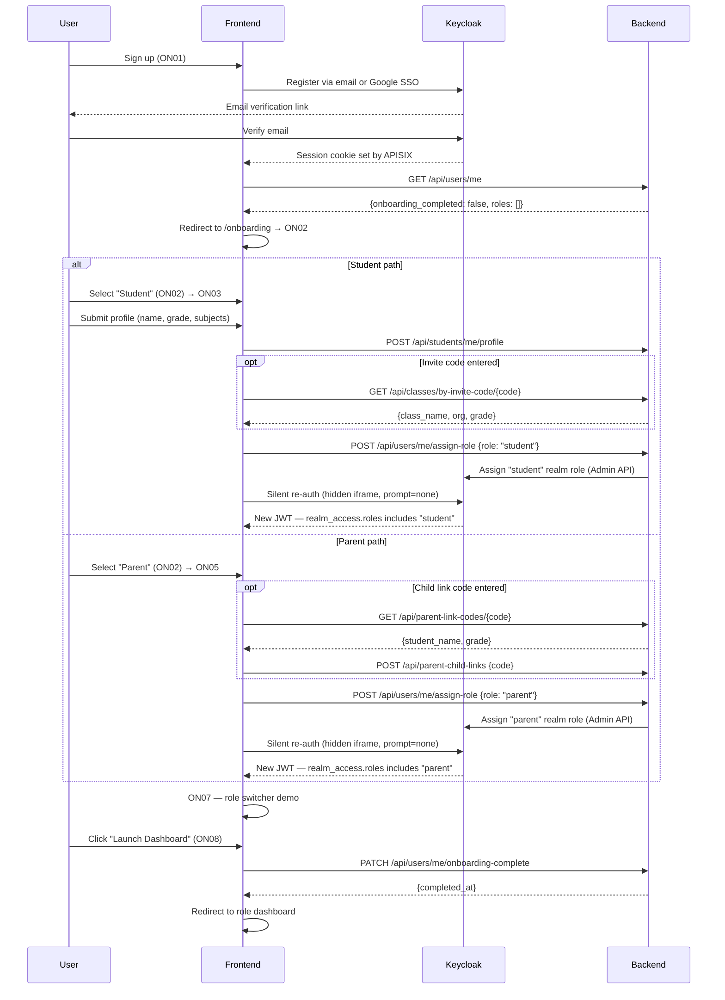

# hAIsir — Onboarding Specification
> Version 1.0 | First-time user onboarding flow and role switcher UX.
> → Depends on: `00_overview.md`, `01_data_model.md`, `02_auth_and_roles.md`
> → UI mapping: `ui-mapping/ui_onboarding.md`

---

## 1. Overview

Onboarding runs once — immediately after a new user verifies their email via Keycloak. It:
1. Welcomes the user
2. Lets them select one or more roles
3. Runs a short role-specific setup sequence (1–2 steps per role)
4. Lands them on the role switcher screen, then their primary dashboard

Institution admins, instructors, and platform admins (`admin`) are never onboarded through this flow — they are invited or created directly. Tutors use a separate "Become a tutor" registration flow (not part of onboarding).

The following diagram shows the full onboarding sequence, including the branching between Student and Parent paths and the token refresh after role assignment:



---

## 2. Screens

| # | Screen ID | Name |
|---|---|---|
| ON01 | `welcome` | Welcome / sign-up |
| ON02 | `role-select` | Role selection grid (Student / Parent only) |
| ON03 | `setup-student` | Student setup |
| ON04 | ~~`setup-teacher`~~ | ~~Teacher / instructor setup~~ — **removed from onboarding** (instructor invited by institution_admin) |
| ON05 | `setup-parent` | Parent setup — link child |
| ON06 | ~~`setup-tutor`~~ | ~~Tutor setup~~ — **removed from onboarding** (separate "Become a tutor" flow) |
| ON07 | `role-switcher` | Role switcher demo / confirmation |
| ON08 | `ready` | Success — launch dashboard |

---

## 3. Screen Specifications

### ON01 — Welcome / Sign-up

**Purpose:** Account creation entry point. Supports Google SSO and email+password.

**States:**
- **Sign-up:** Name, email, password fields. "Continue with Google" button. "Already have an account? Log in" link.
- **Login:** Email, password. "Continue with Google". "Forgot password" link.

**Business rules:**
- **BR-ON-001:** Password minimum 8 characters. Validated client-side before submission.
- **BR-ON-002:** Google SSO delegates to Keycloak's Google identity provider — no custom OAuth code needed.
- **BR-ON-003:** After successful sign-up, Keycloak sends email verification. User cannot proceed to ON02 until email is verified.
- **BR-ON-004:** Existing users who log in and already have roles assigned skip ON02–ON06 and go directly to ON07.

**API calls:**
```
GET /api/auth/csrf
→ Returns: {csrf_token}
→ No auth required (bootstraps CSRF for onboarding)
```
All subsequent onboarding calls require `X-CSRF-Token` and the session cookie set by APISIX after Keycloak auth.

---

### ON02 — Role Selection

**Purpose:** User picks one role to start with. Single selection only.

**Roles shown:**
- Student
- Parent

**Not shown:** `instructor` (invited by institution_admin), `tutor` (separate "Become a tutor" flow), `institution_admin`, `admin`.

**Business rules:**
- **BR-ON-005:** Exactly one role must be selected to proceed. No multi-select — users pick either Student or Parent.
- **BR-ON-006:** Selection determines which setup screen runs next: Student → ON03, Parent → ON05. No branching or sequential setup.
- **BR-ON-006a:** A user who onboards as a Student can later add the Parent role (and vice versa) from their profile/settings page via `POST /api/users/me/assign-role`. This triggers the corresponding setup flow inline (not a full re-onboarding).
- **BR-ON-007:** ~~Removed.~~ Teacher and Tutor are no longer selectable during onboarding.

---

### ON03 — Student Setup

**Purpose:** Collect grade and subjects to personalise the experience.

**Fields:**
- First name, last name
- Grade (dropdown: Grade 5 through Grade 12, Undergraduate)
- Subjects (multi-select tag picker)

**Step 2 — Start mode:**
- Join institution (invite code input + search by name)
- Explore open courses (browse-first)
- Both
- Skip — set up later

**Business rules:**
- **BR-ON-008:** Name and grade are required. Subjects are optional but encouraged.
- **BR-ON-009:** Invite code validation is live (debounced 500ms). Valid code shows institution name, board, grade. Normalise to uppercase before validation.
- **BR-ON-010:** Skipping start mode creates the student profile but no enrollment. Student lands on empty home state.

**API calls:**
```
POST /api/students/me/profile
→ Auth: student (X-Current-Role: student)
→ Body: {first_name, last_name, grade, subjects}
→ Returns: {profile_id}

GET /api/classes/by-invite-code/{code}
→ Returns: {class_id, class_name, organization_name, board, grade} | 404
```

---

### ON04 — Teacher / Instructor Setup — ~~REMOVED FROM ONBOARDING~~

> **This screen is no longer part of the onboarding flow.** Instructors are invited by institution_admin via email/userid. After accepting the invite, the instructor completes profile setup on their first login to the teacher dashboard (inline setup, not onboarding).

**Retained for reference — instructor profile setup fields (used in first-login flow):**
- Subjects (multi-select tag picker)
- Grades you teach (dropdown)
- Years of experience (dropdown)

**Business rules:**
- **BR-ON-011:** ~~Removed.~~ Instructor role is assigned by institution_admin invite, not self-selected.
- **BR-ON-012:** ~~Removed.~~ Tutor role uses separate "Become a tutor" flow.
- **BR-ON-013:** At least one subject and grade range are required for profile completion.
- **BR-ON-014:** On first login after invite acceptance: "Welcome! Complete your profile to start teaching."

**API calls:**
```
POST /api/teachers/me/profile
→ Auth: instructor (X-Current-Role: instructor)
→ Body: {first_name, last_name, subjects, grades, years_experience}
→ Returns: {profile_id}
```

---

### ON05 — Parent Setup

**Purpose:** Link the parent account to a child via invite code.

**Fields:**
- Child link code (single large input, uppercase, auto-formatted)

**Validation:** Live on input. Match against `parent_child_links` table. Show child name, grade, school on match.

**Business rules:**
- **BR-ON-015:** Code is optional — parent can skip and link later from their dashboard.
- **BR-ON-016:** Valid code → create `parent_child_links` record with `status = 'linked'`.
- **BR-ON-017:** Expired code (>7 days) shows: "This code has expired. Ask your child to generate a new one."
- **BR-PARENT-001** (from data model): One active code per student. Multiple parents can use the same code before it expires.

**API calls:**
```
GET /api/parent-link-codes/{code}
→ Returns: {student_name, grade, school} | 404 | 410 (expired)

POST /api/parent-child-links
→ Auth: parent (X-Current-Role: parent)
→ Body: {code}
→ Returns: {link_id, student_idp_sub, student_name}
→ Errors: 404, 410 expired, 409 already linked
```

---

### ON06 — Tutor Setup — ~~REMOVED FROM ONBOARDING~~

> **This screen is no longer part of the onboarding flow.** Tutor registration is a separate explicit flow (like Udemy's "Become an instructor"), accessible from the user's profile or a "Become a tutor" link. See `POST /api/users/me/become-tutor` in `11_role_migration.md` section 4.5.

**Retained for reference — tutor registration fields (used in "Become a tutor" flow):**
- Subjects (multi-select tag picker)
- Grades you teach (dropdown)
- Bio (textarea, optional)
- Availability (free text, optional)
- "List me in tutor marketplace" toggle — default OFF

**Business rules:**
- **BR-ON-018:** Subjects and grades are required. All other fields optional.
- **BR-ON-019:** Marketplace listing toggle set to ON creates `marketplace_listed = true`. Profile is immediately visible in the student marketplace. Show note: "Your profile is now live in the marketplace."
- **BR-ON-020:** ~~Removed.~~ Tutor setup no longer follows teacher setup in onboarding.

**API calls:**
```
POST /api/users/me/become-tutor
→ Auth: any authenticated user
→ Body: {subjects, grades, bio?, availability?, marketplace_listed}
→ Returns: {assigned: true, role: "tutor", profile_id}
→ Errors: 409 if already a tutor
```

---

### ON07 — Role Switcher

**Purpose:** Show the user their configured roles and explain the switcher mechanic. For single-role users this is brief. For multi-role users this is the key orientation screen.

**Layout:**
- "Currently viewing as: [Role]" heading
- Role cards for each assigned role — click to switch active role
- Topbar updates colour and label on switch
- Explanation card: "Each role has its own workspace. Switching doesn't log you out."

**Business rules:**
- **BR-ON-021:** Active role on this screen defaults to the first role the user set up.
- **BR-ON-022:** Role switcher state is stored in `localStorage`. On every page load, the stored value is validated against the JWT's `realm_access.roles`. If invalid, defaults to first role in list.
- **BR-ON-023:** The topbar colour changes to match the active role's colour (student = `#0A1F5C`, instructor = `#0A3D2B`, tutor = `#3C1F6E`, parent = `#3D2000`, admin = `#080F17`).
- **BR-ON-024:** `X-Current-Role` header is set to the active role for all subsequent API calls.

---

### ON08 — Ready

**Purpose:** Success confirmation. "Launch dashboard" navigates to the correct home screen for the active role.

**Business rules:**
- **BR-ON-025:** Destination per role: student → `/home/dashboard`, instructor → `/teacher`, tutor → `/teacher`, parent → `/parent`, admin → `/admin`.
- **BR-ON-026:** Onboarding completion is recorded in `user_metadata.onboarding_completed_at`. The frontend checks `onboarding_completed` from `GET /api/users/me` and caches the result in `localStorage` for the session. The cache is invalidated and re-fetched only on hard reload or immediately after `PATCH /api/users/me/onboarding-complete` succeeds. If `false`, redirect to `/onboarding`. If `true`, redirect to the role dashboard. Admin and institution_admin users always have `onboarding_completed = true` (set at first login).

**API calls:**
```
PATCH /api/users/me/onboarding-complete
→ Auth: any authenticated session (no X-Current-Role required — explicit exception to BR-SEC-006)
→ Action: sets user_metadata.onboarding_completed_at = now()
→ Returns: {completed_at: datetime}
```

---

## 4. Role Switcher (Persistent — Post-Onboarding)

After onboarding, the role switcher lives in the topbar on every screen for multi-role users.

**Behaviour:**
- Shows pill buttons for each role the user holds
- Active role pill is highlighted (white/opaque background)
- Clicking a different role: updates `localStorage`, updates `X-Current-Role`, re-renders the entire workspace for that role, changes topbar colour
- Does NOT log the user out or make a new auth request

**Business rules:**
- **BR-ON-027:** Single-role users do not see the role switcher — no visual noise for the majority of users.
- **BR-ON-028:** Multi-role users always see the switcher. It is never hidden post-onboarding.
- **BR-ON-029:** If a user's role is revoked in Keycloak (e.g. tutor suspended), the JWT on next refresh will not contain that role. The frontend must handle this gracefully — remove the pill and switch to the next available role.

---

## 5. Edge Cases

| Scenario | Behaviour |
|---|---|
| User closes browser mid-onboarding | Keycloak session persists. On return, resume from last completed step. |
| Google SSO user — name already in Keycloak profile | Pre-fill first/last name from Keycloak `given_name` / `family_name` claims |
| Invite code valid but class is full | Show: "This class is currently full. Contact your institution admin." |
| Parent code used — child already linked to this parent | 409 → show: "You are already linked to this child." |
| Invited instructor hits `/onboarding` | The `instructor` role is already in their JWT. Skip ON02–ON06 and go to ON07 (role switcher demo), then redirect to `/teacher` for inline profile setup. |
| Institution admin hits `/onboarding` | The `institution_admin` role is already assigned. `onboarding_completed_at` was set on first login — redirect immediately to `/institution`. |
| Admin user hits `/onboarding` | Redirect immediately to `/admin` — skip all onboarding steps. |
