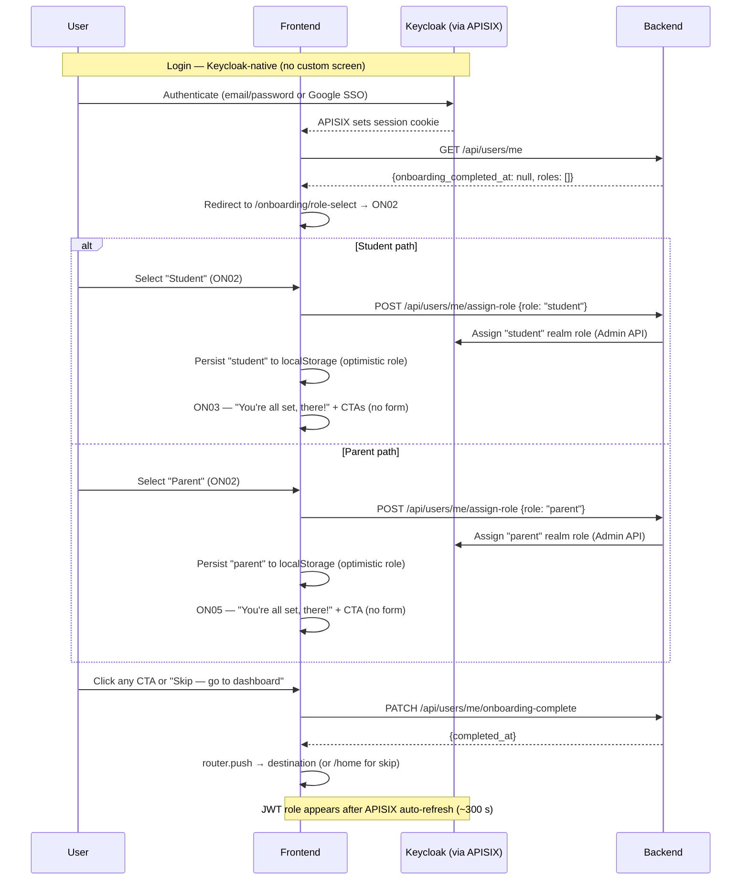

# hAIsir — Onboarding Specification
> Version 1.0 | First-time user onboarding flow and role switcher UX.
> → Depends on: `00_overview.md`, `01_data_model.md`, `02_auth_and_roles.md`
> → UI mapping: `ui-mapping/ui_onboarding.md`

---

## 1. Overview

Onboarding runs once — immediately after a new user authenticates via Keycloak. It:
1. Redirects the user to Keycloak's native login page (no custom sign-up screen)
2. Lets them select one role (Student or Parent)
3. Shows a role-specific "You're all set" screen with launch CTAs
4. Lands them on the role switcher screen, then their primary dashboard

Institution admins, instructors, and platform admins (`admin`) are never onboarded through this flow — they are invited or created directly. Tutors use a separate "Become a tutor" registration flow (not part of onboarding).

Login and sign-up are handled entirely by Keycloak's native IDP page (email/password and Google SSO). APISIX intercepts unauthenticated requests and redirects to Keycloak. No custom ON01 screen is built.

The following diagram shows the full onboarding sequence, including the branching between Student and Parent paths and the token refresh after role assignment:



---

## 2. Screens

| # | Screen ID | Name |
|---|---|---|
| ON01 | `auth` | Keycloak login (native) — not a custom screen |
| ON02 | `role-select` | Role selection grid (Student / Parent only) |
| ON03 | `setup-student` | Student ready — role badge + launch CTAs |
| ON04 | ~~`setup-teacher`~~ | ~~Teacher / instructor setup~~ — **removed from onboarding** (instructor invited by institution_admin) |
| ON05 | `setup-parent` | Parent ready — role badge + link-child CTA |
| ON06 | ~~`setup-tutor`~~ | ~~Tutor setup~~ — **removed from onboarding** (separate "Become a tutor" flow) |
| ON07 | `role-switcher` | Role switcher demo / confirmation |
| ON08 | `ready` | Success — launch dashboard |

---

## 3. Screen Specifications

### ON01 — Keycloak Login (native — not a custom screen)

**Purpose:** Authentication entry point. Handled entirely by Keycloak's native IDP page.

**How it works:**
- APISIX intercepts all unauthenticated requests and redirects the browser to Keycloak's login page.
- Keycloak renders its own UI: email/password sign-up/login and "Continue with Google" (Google SSO configured as Keycloak identity provider).
- On successful authentication, APISIX sets an `httpOnly` session cookie on the browser.
- The frontend receives the callback and calls `GET /api/users/me` to determine onboarding state.
- If `onboarding_completed: false` (and `roles` is empty), redirect to `/onboarding/role-select` (ON02).

> **No custom frontend screen is built for ON01.** Password policy, email verification, and SSO configuration are all Keycloak realm settings.

**Business rules:**
- ~~BR-ON-001~~ — Password policy is a Keycloak realm setting (minimum 8 chars configured there).
- ~~BR-ON-002~~ — Google SSO is a Keycloak identity provider configuration — no custom OAuth code.
- ~~BR-ON-003~~ — Email verification is a Keycloak flow setting — enforced by Keycloak before issuing a session.
- **BR-ON-004:** After the Keycloak callback: if `GET /api/users/me` returns a user who already has roles and `onboarding_completed_at` is set, redirect directly to the role dashboard — skip ON02–ON06.
- **BR-ON-004a:** On every root page load (`/`), the frontend calls `GET /api/users/me`. If `onboarding_completed_at` is `null` (or `onboarding_completed` is `false` / absent), the user is redirected to `/onboarding/role-select`. The `haisir_onboarding_done` cookie approach is deprecated. The frontend handles both `onboarding_completed` (boolean, per BR-META-001) and `onboarding_completed_at` (raw timestamp) defensively — whichever the backend returns.
- **BR-ON-004b:** Any authenticated route not under `/onboarding/` must redirect to `/onboarding/role-select` if onboarding is incomplete (`onboarding_completed !== true`). The `/home` dashboard is the primary enforced route.

**API calls:**
```
GET /api/auth/csrf
→ Returns: {csrf_token}
→ No auth required (bootstraps CSRF for onboarding)
```
All subsequent onboarding calls require `X-CSRF-Token` and the session cookie set by APISIX after Keycloak auth.

---

### ON02 — Role Selection

**Purpose:** User picks one role to start with. Single selection only.

**Roles shown:**
- Student
- Parent

**Not shown:** `instructor` (invited by institution_admin), `tutor` (separate "Become a tutor" flow), `institution_admin`, `admin`.

**Business rules:**
- **BR-ON-005:** Exactly one role must be selected to proceed. No multi-select — users pick either Student or Parent.
- **BR-ON-006:** Selection determines which setup screen runs next: Student → ON03, Parent → ON05. No branching or sequential setup.
- **BR-ON-006a:** A user who onboards as a Student can later add the Parent role (and vice versa) from their profile/settings page via `POST /api/users/me/assign-role`. This triggers the corresponding setup flow inline (not a full re-onboarding).
- **BR-ON-007:** ~~Removed.~~ Teacher and Tutor are no longer selectable during onboarding.
- **Back button:** The `← Back` button on this screen navigates to Keycloak logout (`/auth/logout?redirect_uri=/auth/login`), returning the user to the Keycloak login page.

---

### ON03 — Student Ready

**Route:** `/onboarding/student-ready`

**Purpose:** Confirm the student role has been assigned. Offer two paths to get started. No profile data collected here.

**Layout:**
- Party popper icon (top centre)
- `h2`: "You're all set, there!"
- Subtext: "Your Student account is ready. Here's what to do first."
- Role badge chip: "🎓 Student"
- CTA card 1: **"Join your school"** — "Enter invite code or search by name" → navigates to join-institution flow
- CTA card 2: **"Browse open courses"** — "Find topics and tutors" → navigates to open-course browse
- Skip link: "Skip — go to dashboard"
- No form fields. No "Continue →" button.

**Business rules:**
- **BR-ON-008:** Student profile data (name, grade, subjects) is NOT collected during onboarding. The `student_profiles` row is created at role-assignment time (`POST /api/users/me/assign-role`) using Keycloak `given_name`/`family_name` claims if present; otherwise row creation is deferred to the student's first profile save.
- **BR-ON-009:** Invite code validation applies when the user navigates to the join-institution flow via the "Join your school" CTA (not inline on this screen).
- **BR-ON-010:** Tapping neither CTA (using the skip link or going directly to dashboard) creates the student role assignment only. Student lands on the home dashboard in empty state.

**API calls:**
```
PATCH /api/users/me/onboarding-complete
→ Called on any CTA click or "Skip — go to dashboard" BEFORE navigation.
→ Sets user_metadata.onboarding_completed_at = now()
→ Returns: {completed_at: datetime}
```

---

### ON04 — Teacher / Instructor Setup — ~~REMOVED FROM ONBOARDING~~

> **This screen is no longer part of the onboarding flow.** Instructors are invited by institution_admin via email/userid. After accepting the invite, the instructor completes profile setup on their first login to the teacher dashboard (inline setup, not onboarding).

**Retained for reference — instructor profile setup fields (used in first-login flow):**
- Subjects (multi-select tag picker)
- Grades you teach (dropdown)
- Years of experience (dropdown)

**Business rules:**
- **BR-ON-011:** ~~Removed.~~ Instructor role is assigned by institution_admin invite, not self-selected.
- **BR-ON-012:** ~~Removed.~~ Tutor role uses separate "Become a tutor" flow.
- **BR-ON-013:** At least one subject and grade range are required for profile completion.
- **BR-ON-014:** On first login after invite acceptance: "Welcome! Complete your profile to start teaching."

**API calls:**
```
POST /api/teachers/me/profile
→ Auth: instructor (X-Current-Role: instructor)
→ Body: {first_name, last_name, subjects, grades, years_experience}
→ Returns: {profile_id}
```

---

### ON05 — Parent Ready

**Route:** `/onboarding/parent-ready`

**Purpose:** Confirm the parent role has been assigned. Offer the link-child path. No code entry during onboarding.

**Layout:**
- Party popper icon (top centre)
- `h2`: "You're all set, there!"
- Subtext: "Your Parent / Guardian account is ready. Here's what to do first."
- Role badge chip: "👨‍👩‍👧 Parent / Guardian" (warm peach background)
- CTA card: **"Link your child"** — "Enter their hAIsir link code" → navigates to the link-child flow (separate screen, post-onboarding)
- Skip link: "Skip — link later from dashboard"
- No inline code input on this screen.

**Business rules:**
- **BR-ON-015:** The parent-child link flow is accessed post-onboarding via the "Link your child" CTA or the parent dashboard. No invite code is entered during onboarding itself.
- ~~BR-ON-016~~ — Moved to the post-onboarding link-child flow: valid code creates `parent_child_links` record.
- ~~BR-ON-017~~ — Moved to the post-onboarding link-child flow: expired code shows appropriate error.
- **BR-PARENT-001** (from data model): One active code per student. Multiple parents can use the same code before it expires.

**API calls:**
```
PATCH /api/users/me/onboarding-complete
→ Called on "Link your child" CTA or "Skip — link later" BEFORE navigation.
→ Sets user_metadata.onboarding_completed_at = now()
→ Returns: {completed_at: datetime}
```
Link code validation and `POST /api/parent-child-links` happen in the separate post-onboarding link-child flow.

---

### ON06 — Tutor Setup — ~~REMOVED FROM ONBOARDING~~

> **This screen is no longer part of the onboarding flow.** Tutor registration is a separate explicit flow (like Udemy's "Become an instructor"), accessible from the user's profile or a "Become a tutor" link. See `POST /api/users/me/become-tutor` in `11_role_migration.md` section 4.5.

**Retained for reference — tutor registration fields (used in "Become a tutor" flow):**
- Subjects (multi-select tag picker)
- Grades you teach (dropdown)
- Bio (textarea, optional)
- Availability (free text, optional)
- "List me in tutor marketplace" toggle — default OFF

**Business rules:**
- **BR-ON-018:** Subjects and grades are required. All other fields optional.
- **BR-ON-019:** Marketplace listing toggle set to ON creates `marketplace_listed = true`. Profile is immediately visible in the student marketplace. Show note: "Your profile is now live in the marketplace."
- **BR-ON-020:** ~~Removed.~~ Tutor setup no longer follows teacher setup in onboarding.

**API calls:**
```
POST /api/users/me/become-tutor
→ Auth: any authenticated user
→ Body: {subjects, grades, bio?, availability?, marketplace_listed}
→ Returns: {assigned: true, role: "tutor", profile_id}
→ Errors: 409 if already a tutor
```

---

### ON07 — Role Switcher

**Purpose:** Show the user their configured roles and explain the switcher mechanic. For single-role users this is brief. For multi-role users this is the key orientation screen.

**Layout:**
- "Currently viewing as: [Role]" heading
- Role cards for each assigned role — click to switch active role
- Topbar updates colour and label on switch
- Explanation card: "Each role has its own workspace. Switching doesn't log you out."

**Business rules:**
- **BR-ON-021:** Active role on this screen defaults to the first role the user set up.
- **BR-ON-022:** Role switcher state is stored in `localStorage`. On every page load, the stored value is validated against the JWT's `realm_access.roles`. If invalid, defaults to first role in list.
- **BR-ON-023:** The topbar colour changes to match the active role's colour (student = `#0A1F5C`, instructor = `#0A3D2B`, tutor = `#3C1F6E`, parent = `#3D2000`, admin = `#080F17`).
- **BR-ON-024:** `X-Current-Role` header is set to the active role for all subsequent API calls.

---

### ON08 — Ready

**Purpose:** Success confirmation. "Launch dashboard" navigates to the correct home screen for the active role.

**Business rules:**
- **BR-ON-025:** Destination per role: student → `/home/dashboard`, instructor → `/teacher`, tutor → `/teacher`, parent → `/parent`, admin → `/admin`.
- **BR-ON-026:** Onboarding completion is recorded in `user_metadata.onboarding_completed_at`. The frontend checks `onboarding_completed` from `GET /api/users/me` and caches the result in `localStorage` for the session. The cache is invalidated and re-fetched only on hard reload or immediately after `PATCH /api/users/me/onboarding-complete` succeeds. If `false`, redirect to `/onboarding`. If `true`, redirect to the role dashboard. Admin and institution_admin users always have `onboarding_completed = true` (set at first login).

**API calls:**
```
PATCH /api/users/me/onboarding-complete
→ Auth: any authenticated session (no X-Current-Role required — explicit exception to BR-SEC-006)
→ Action: sets user_metadata.onboarding_completed_at = now()
→ Returns: {completed_at: datetime}
```

---

## 4. Role Switcher (Persistent — Post-Onboarding)

After onboarding, the role switcher lives in the topbar on every screen for multi-role users.

**Behaviour:**
- Shows pill buttons for each role the user holds
- Active role pill is highlighted (white/opaque background)
- Clicking a different role: updates `localStorage`, updates `X-Current-Role`, re-renders the entire workspace for that role, changes topbar colour
- Does NOT log the user out or make a new auth request

**Business rules:**
- **BR-ON-027:** Single-role users do not see the role switcher — no visual noise for the majority of users.
- **BR-ON-028:** Multi-role users always see the switcher. It is never hidden post-onboarding.
- **BR-ON-029:** If a user's role is revoked in Keycloak (e.g. tutor suspended), the JWT on next refresh will not contain that role. The frontend must handle this gracefully — remove the pill and switch to the next available role.

---

## 5. Edge Cases

| Scenario | Behaviour |
|---|---|
| User closes browser mid-onboarding | Keycloak session persists. On return, resume from last completed step. |
| Google SSO user | Keycloak `given_name` / `family_name` claims are passed through to auto-populate `student_profiles.first_name`/`last_name` at role-assignment time (backend uses these claims when creating the profile row). |
| Invite code valid but class is full | Handled in the post-onboarding join-school flow (not during onboarding). Show: "This class is currently full. Contact your institution admin." |
| Parent code expired or already used | Handled in the post-onboarding link-child flow (not during onboarding). Expired: 410 response. Already linked: 409. |
| Invited instructor hits `/onboarding` | The `instructor` role is already in their JWT. Skip ON02–ON06 and go to ON07 (role switcher demo), then redirect to `/teacher` for inline profile setup. |
| Institution admin hits `/onboarding` | The `institution_admin` role is already assigned. `onboarding_completed_at` was set on first login — redirect immediately to `/institution`. |
| Admin user hits `/onboarding` | Redirect immediately to `/admin` — skip all onboarding steps. |
